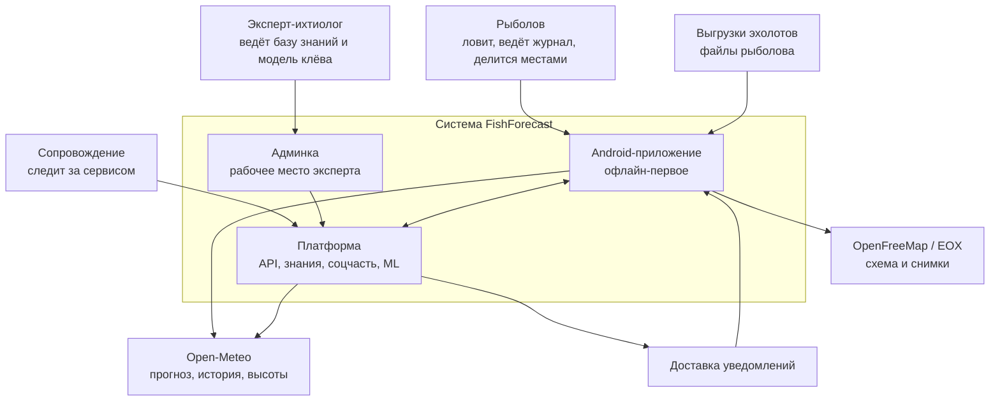

# Архитектурный манифест

Верхнеуровневое описание системы: что она делает, где проходят её границы, на
чём она стоит и какие правила не подлежат обсуждению при проектировании
частностей.

## Что это за система

FishForecast отвечает рыболову на один вопрос: **ехать сегодня или нет, и если
ехать — куда встать, чем ловить и как кормить.** Ответ собирается из погоды,
модели воды, знаний о видах и знаний о конкретном месте.

Дальше система расширяется в три стороны:

1. **Знание перестаёт быть частью сборки.** Словари, справочник видов и веса
   модели клёва правятся экспертом в админке и приезжают на клиент документом с
   версией.
2. **У рыболовов появляется общее.** Стена уловов, чаты, обмен районами, общий
   реестр мест.
3. **Данные возвращаются в модель.** Уловы со снимком условий собираются на
   сервере, по ним обучаются модели, и результат выпускается обратно —
   коэффициентами, которые клиент считает своей же эвристикой.

## Инварианты

Это не пожелания, а рамки: решение, которое их нарушает, отклоняется независимо
от того, насколько оно удобно.

| Инвариант | Что значит на практике |
|---|---|
| **Офлайн — не режим, а норма** | На воде сети нет. Всё, что нужно для решения «ехать или нет» и для ловли, лежит на устройстве. Сервер недоступен — приложение работает целиком, кроме социальной части |
| **Room — единственный источник правды на клиенте** | UI и воркеры читают из базы, а не из сети. Сеть только наполняет базу |
| **Знание — данные, а не код** | Коэффициенты, пороги, словари живут в версионируемых документах. Новый вид рыбы или новый вес фактора не требует релиза приложения |
| **Модель считается на клиенте, обучается на сервере** | Клиент — проверенная детерминированная эвристика: одинаковый вход даёт одинаковый выход и объяснимую причину. ML остаётся на сервере, наружу выходит коэффициентами |
| **Личное не публикуется молча** | Точки, уловы и маршруты — секреты. Публикация — отдельное осознанное действие с выбором, что уходит |
| **Отказ лучше тихой порчи** | Документ с чужой или будущей схемой отвергается с причиной, а не читается наполовину |
| **Совместимость назад по данным** | Пакеты и документы старых версий читаются. Незнакомые поля игнорируются, отсутствующие берут значения по умолчанию |

## Границы системы

**Внутри системы:** Android-клиент, серверная платформа, админка.

**Снаружи и не наше:** прогноз погоды (Open-Meteo), тайлы карт (OpenFreeMap,
Sentinel-2 от EOX), файлы эхолотов, магазины приложений, доставка push.

**Чего система не делает:** не заменяет навигацию, не торгует снастями, не
обещает точность там, где данных нет — если нормы давления или глубин не хватает,
фактор не оценивается вовсе.

## Стек

| Часть | Технологии | Почему |
|---|---|---|
| Android | Kotlin, Jetpack Compose, Room, DataStore, WorkManager, Hilt, Retrofit, MapLibre | Уже работает; Room как SSOT и WorkManager для фоновой синхронизации — основа офлайн-первого |
| Сервер | Python, FastAPI, Pydantic, SQLAlchemy | Один язык с ML-частью; схемы Pydantic дают OpenAPI без ручной работы |
| Хранилище | PostgreSQL + PostGIS | Районы, точки и глубины — геометрия; пространственные выборки нужны с первого дня |
| Файлы | S3-совместимое хранилище | Фото уловов, выгрузки эхолотов, опубликованные документы знаний |
| Очередь и фон | Брокер задач (Redis/RabbitMQ) + воркеры | Обработка батиметрии и обучение моделей не должны держать запрос |
| Админка | Веб-SPA поверх того же API | Эксперт правит знания без git и без релиза приложения |
| ML | Python: pandas, scikit-learn, градиентный бустинг | Датасет маленький и табличный; тяжёлые сети здесь не нужны |
| Реальное время | WebSocket через тот же шлюз | Чаты и уведомления стены |

Версии клиентских зависимостей зафиксированы в `gradle/libs.versions.toml` и на
момент написания отстают почти на год — обновление входит в фазу 6.

## Нефункциональные требования

| Требование | Значение | Как проверяется |
|---|---|---|
| Работа без сети | Полный сценарий рыбалки без единого сетевого запроса | Ручной прогон в авиарежиме на каждой фазе |
| Размер пакета района | Килобайты, отправляется мессенджером | Тест на реальном районе |
| Холодный старт | До первого экрана не более 2 с на среднем устройстве | Замер на устройстве |
| Расход батареи | Фоновая синхронизация не чаще раза в 6 часов, GPS — по запросу | Профиль WorkManager |
| Ответ API | 95-й процентиль до 300 мс на чтение | Метрики шлюза |
| Приватность | Точки и уловы по умолчанию приватны; публикация — явное действие | Обзор экранов и API |
| Восстановление | Потеря сервера не мешает клиенту; данные клиента не теряются | Учения по бэкапу |

## Связанные документы

Контейнеры — [02-containers.md](02-containers.md). Потоки данных —
[03-dataflow.md](03-dataflow.md). Решения и их причины — [adr/](adr/).
