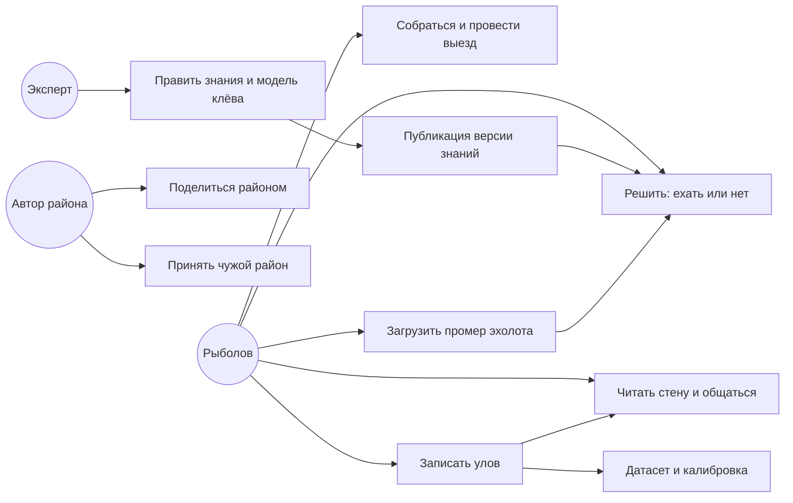
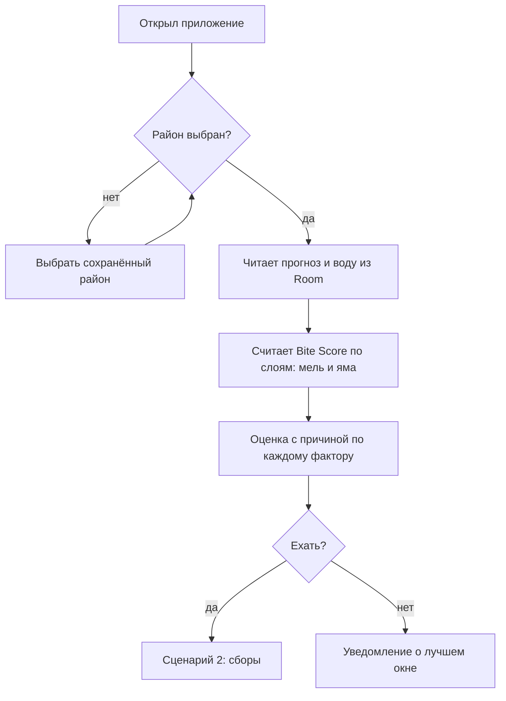
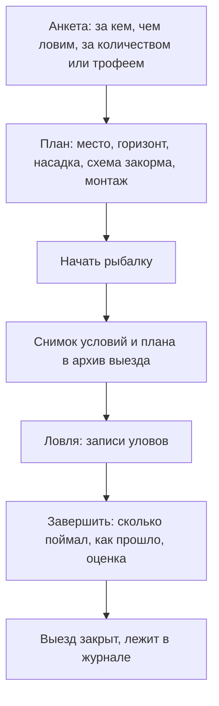
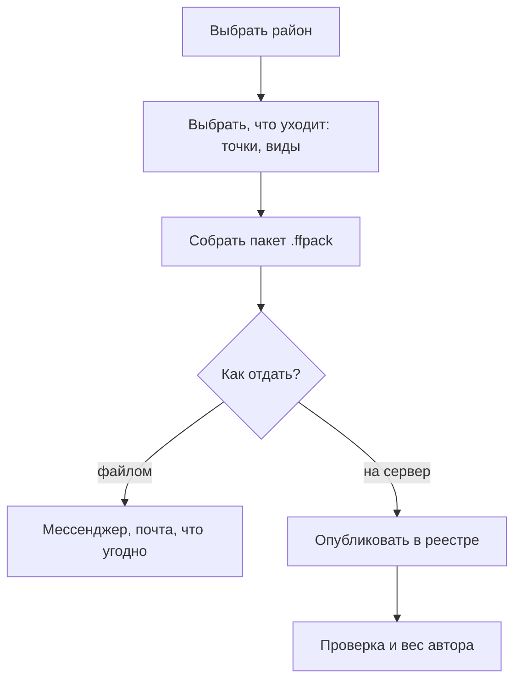
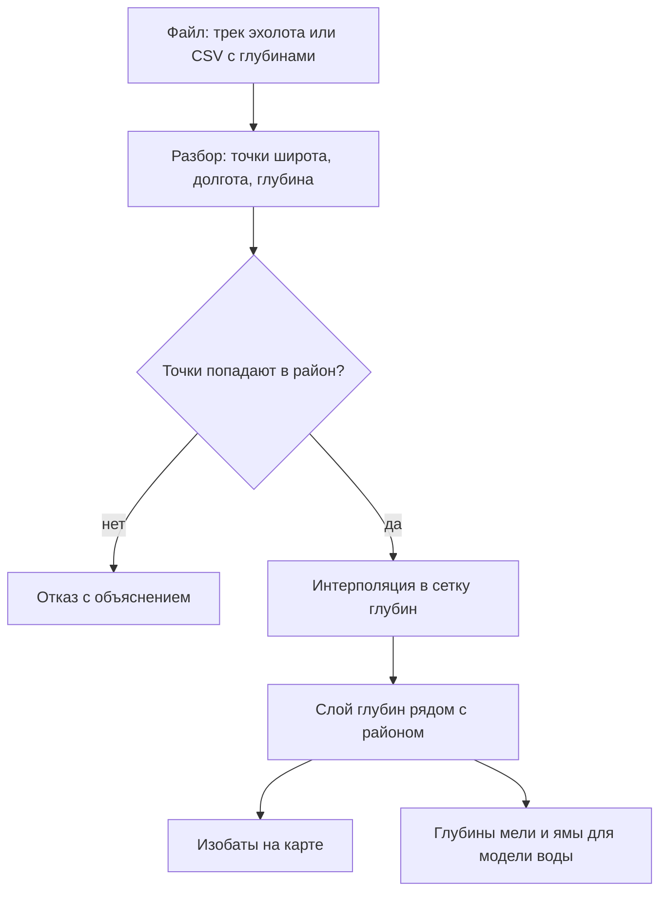
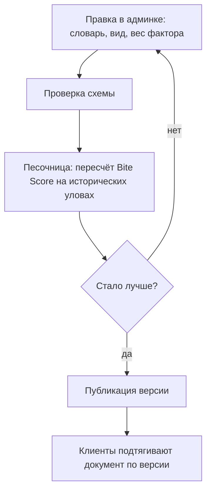

# Сценарии пользователя

Документ отвечает на вопрос, ради которого вообще существуют данные: **зачем и
как они попадают в систему.** Каждый сценарий кончается тем, что где-то
появляется запись, и дальше по этой записи строятся потоки в
[03-dataflow.md](03-dataflow.md) и таблицы в
[04-data-dictionary.md](04-data-dictionary.md).

## Действующие лица

| Роль | Кто это | Что ему нужно |
|---|---|---|
| Рыболов | Основной пользователь | Решить, ехать ли, и не остаться без данных на воде |
| Автор района | Тот же рыболов, поделившийся местом | Отдать знание товарищу, не отдав лишнего |
| Эксперт | Ихтиолог или опытный карпятник | Править словари и веса модели без релиза приложения |
| Сопровождение | Тот, кто держит сервер | Видеть, что происходит, и чинить |

## Карта сценариев

## 1. Ехать или нет — офлайн

Главный сценарий. Сеть не нужна: прогноз скачан заранее, знания лежат на
устройстве, расчёт идёт на месте.

Что записывается: ничего. Сценарий только читает — и именно поэтому обязан
работать всегда.

## 2. Сборы и выезд

Что записывается: `fishing_sessions` со снимком условий и текстом плана,
`catches` внутри выезда. Пустой выезд — такие же данные, как удачный: без него
модель не узнает о неудачах.

## 3. Улов

Улов — единственная точка, где сходятся предсказание и факт, поэтому он несёт
полный снимок часа: воду, кислород, давление, ветер, фазу света, оценку клёва,
слой и структуры места.

Что записывается: `catches` + снимок условий. Позже — уезжает в датасет
(сценарий 9) и, по отдельному желанию, на стену (сценарий 7).

## 4. Поделиться районом

Файловый обмен остаётся всегда: он работает без сервера и без учётной записи.
Серверная публикация — надстройка, а не замена.

## 5. Принять чужой район

Правило слияния одно: совпал `uid` — та же запись. Свои пороги видов чужой пакет
не перезаписывает, своя скачанная область тайлов остаётся. Тайлов в пакете нет,
поэтому приложение честно говорит: откройте карту при сети.

## 6. Промер эхолота

Здесь система впервые получает то, чего нет ни в одном открытом источнике, —
батиметрию пруда. Подробности в [client/bathymetry.md](client/bathymetry.md).

## 7. Стена и общение

Стена уловов — лента опубликованных уловов с местом до района, а не до точки.
Чаты — район, водоём, личные. Оба требуют сети и учётной записи; без них
приложение остаётся полным по рыболовной части.

## 8. Эксперт правит знания

Ключевое: между правкой и публикацией стоит проверка на реальных данных.
Подробности в [server/admin-panel.md](server/admin-panel.md).

## 9. Датасет и калибровка

Уловы и выезды, отданные пользователями, собираются в обучающую выборку. Модель
обучается на сервере и выпускается не как модель, а как **набор коэффициентов**
для той же эвристики, что уже работает на клиенте. Так офлайн-расчёт остаётся
детерминированным и объяснимым — см. [adr/0004-no-on-device-ml.md](adr/0004-no-on-device-ml.md).

## Что из этого работает без сервера

| Сценарий | Без сети | Без учётной записи |
|---|---|---|
| 1. Ехать или нет | Да | Да |
| 2. Выезд | Да | Да |
| 3. Улов | Да | Да |
| 4. Поделиться файлом | Да | Да |
| 5. Принять файл | Да | Да |
| 6. Промер эхолота | Да | Да |
| 4/5 через реестр | Нет | Нет |
| 7. Стена и чаты | Нет | Нет |
| 8. Правка знаний | Нет | Нет (роль эксперта) |
| 9. Калибровка | Нет | Нет |
