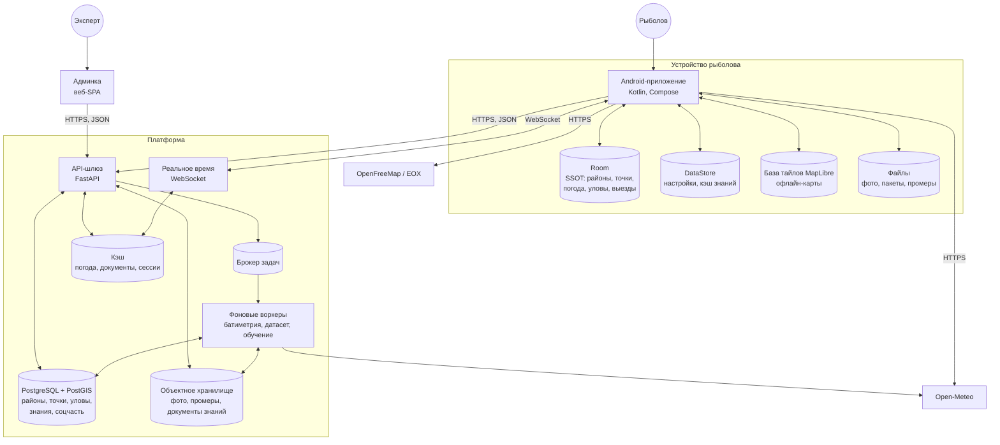

# Контейнеры (C4, уровень 2)

Из чего система состоит физически: что запускается отдельно, что где хранится и
кто с кем разговаривает. Уровень выше — [00-manifest.md](00-manifest.md), уровень
ниже — [client/overview.md](client/overview.md) и
[server/overview.md](server/overview.md).

## Что за что отвечает

| Контейнер | Технология | Ответственность | С кем говорит |
|---|---|---|---|
| Android-приложение | Kotlin, Compose, Hilt | Весь рыболовный сценарий офлайн: расчёт клёва, карта, журнал, планы | Room, DataStore, MapLibre, шлюз, Open-Meteo, тайлы |
| Room | SQLite | Единственный источник правды на клиенте | Только приложение |
| DataStore | Preferences | Настройки, активный район, кэш документов знаний | Только приложение |
| База тайлов MapLibre | SQLite MapLibre | Офлайн-карты; наружу целиком не отдаётся | Только приложение |
| API-шлюз | FastAPI | Единственная дверь наружу: аутентификация, права, валидация, версии | Клиент, админка, БД, хранилище, кэш, брокер |
| Реальное время | WebSocket в том же процессе | Чаты, присутствие, уведомления о новом в ленте | Клиент, кэш |
| Фоновые воркеры | Python | Разбор промеров, сборка датасета, обучение, кэш погоды | Брокер, БД, хранилище, Open-Meteo |
| PostgreSQL + PostGIS | Реляционная БД с геометрией | Районы, точки, глубины, уловы, знания, соцграф | Шлюз, воркеры |
| Объектное хранилище | S3-совместимое | Фото, сырые промеры, опубликованные документы знаний | Шлюз, воркеры, клиент по подписанным ссылкам |
| Кэш | Redis | Ответы Open-Meteo, актуальные версии документов, сессии, каналы | Шлюз, реальное время |
| Брокер задач | Redis/RabbitMQ | Очередь тяжёлой работы | Шлюз, воркеры |
| Админка | Веб-SPA | Рабочее место эксперта поверх того же API | Шлюз |

## Правила границ

**Клиент не ходит в базу сервера.** Только через шлюз, только по контракту из
[server/api/openapi.yaml](server/api/openapi.yaml).

**Шлюз не считает долго.** Всё, что дольше секунды — разбор промера, обучение,
сборка датасета, — уходит в брокер и делается воркером.

**Документы знаний отдаются как файлы.** Публикация кладёт документ в объектное
хранилище и обновляет запись о версии; клиент забирает по ссылке с ETag. Это
позволяет раздавать их через CDN и не нагружать шлюз.

**Тайлы карт мимо платформы.** Их источники внешние, и своих тайлов система пока
не раздаёт — лицензии этого не разрешают
(см. предупреждение в [Roadmap.md](../Roadmap.md)).

**У приложения два независимых сетевых пути:** погода напрямую в Open-Meteo и
платформа. Падение платформы не отнимает прогноз.

## Развёртывание

Как это раскладывается по машинам и окружениям — [server/deployment.md](server/deployment.md).
