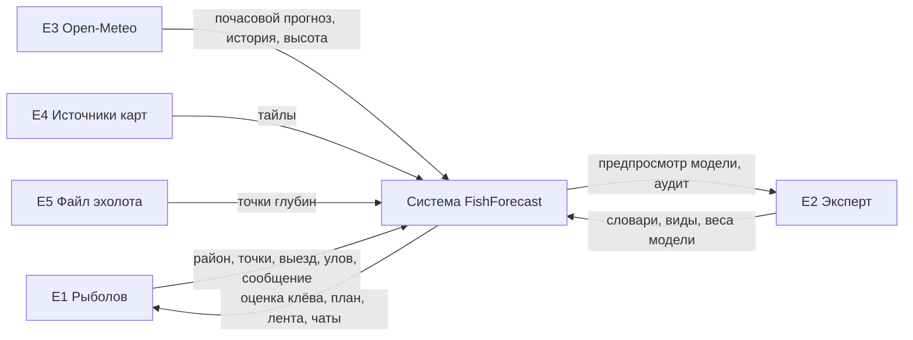
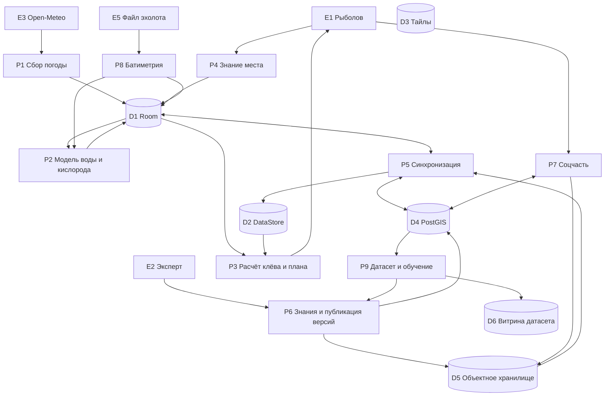

# Потоки данных (DFD)

Куда данные приходят, что с ними делается, где они лежат и куда уходят. Документ
намеренно говорит о процессах, а не о классах: класс переименуют, поток
останется.

Обозначения: **E** — внешняя сущность, **P** — процесс, **D** — хранилище.

## Уровень 0: система целиком

## Уровень 1: процессы и хранилища

## Процессы

| Код | Процесс | Вход | Выход | Где выполняется |
|---|---|---|---|---|
| P1 | Сбор погоды | Координаты района | Почасовой прогноз, восходы, история | Клиент (воркер), сервер (кэш) |
| P2 | Модель воды и кислорода | Прогноз, глубины, тип водоёма | Температура по слоям, кислород | Клиент |
| P3 | Расчёт клёва и плана | Вода, кислород, давление, свет, вид, место, модель клёва | Bite Score с причинами, план выезда | Клиент |
| P4 | Знание места | Действия рыболова | Район, точки, структуры, глубины | Клиент |
| P5 | Синхронизация | Очередь исходящего, версии документов | Обновлённые записи с обеих сторон | Клиент + шлюз |
| P6 | Знания и публикация | Правки эксперта, коэффициенты от P9 | Новая версия документа | Сервер |
| P7 | Соцчасть | Публикации, сообщения | Лента, чаты, реестр районов | Сервер |
| P8 | Батиметрия | Файл промера | Сетка глубин, изобаты, глубины слоёв | Клиент, тяжёлая интерполяция — сервер |
| P9 | Датасет и обучение | Уловы со снимками условий | Коэффициенты и отчёт о качестве | Сервер |

## Хранилища

| Код | Хранилище | Что лежит | Живёт офлайн |
|---|---|---|---|
| D1 | Room | Районы, точки, погода, вода, выезды, уловы, глубины, очередь исходящего | Да |
| D2 | DataStore | Настройки, активный район, кэш документов знаний и их версий | Да |
| D3 | База тайлов MapLibre | Скачанные карты | Да |
| D4 | PostgreSQL + PostGIS | Пользователи, районы, точки, уловы, соцчасть, метаданные знаний | Нет |
| D5 | Объектное хранилище | Фото, сырые промеры, опубликованные документы знаний | Нет |
| D6 | Витрина датасета | Подготовленные признаки и целевые переменные | Нет |

## Что важно в этих стрелках

**Погода приходит на клиент напрямую.** Сервер её тоже кэширует, но для своих
задач — сборки датасета и предпросмотра модели. Если бы клиент ходил за погодой
через платформу, падение платформы отняло бы главный сценарий.

**P3 читает только локальное.** Ни одна стрелка в расчёт клёва не приходит из
сети напрямую: сначала данные попадают в D1/D2, потом считаются. Это и есть
офлайн-первый в одной фразе.

**Публикация знаний идёт в хранилище файлов, а не в базу.** В базе — метаданные
версии; сам документ лежит файлом, раздаётся по ссылке и кэшируется по ETag.

**Датасет односторонний.** Из D4 он собирается, обратно в него не пишет. Влияние
на клиента возможно только через P6 — то есть через опубликованную версию
коэффициентов, которую человек утвердил.

**Личное не попадает в поток само.** Стрелка от улова к P7 и P9 возникает только
после явного согласия рыболова; по умолчанию улов остаётся в D1.
