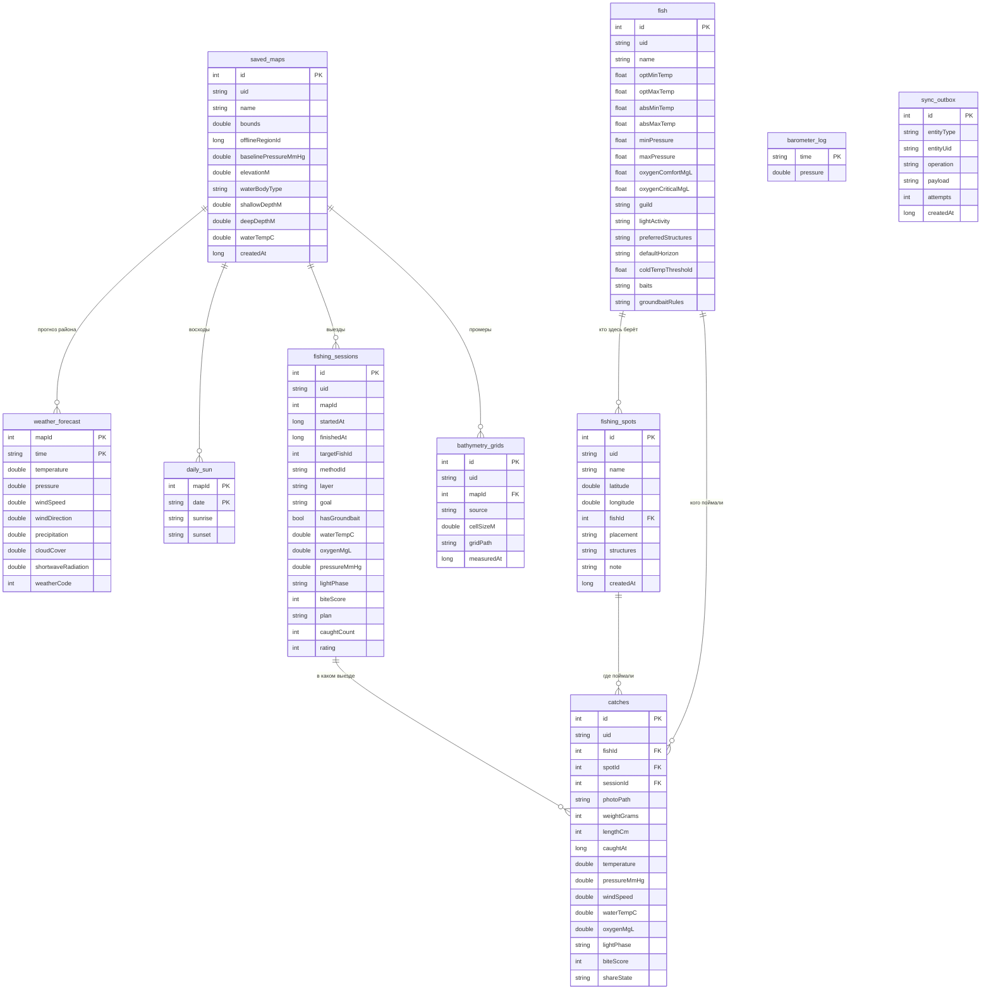
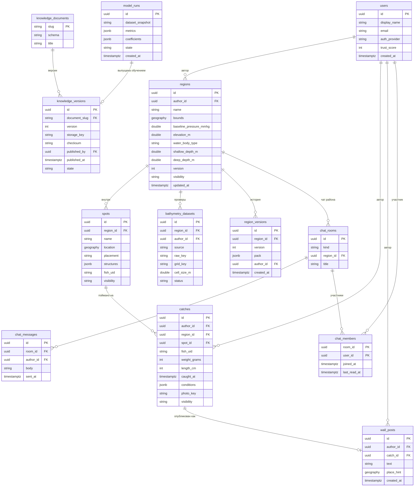

# Словарь данных и ERD

Что где хранится, какого типа, что означает и насколько это личное. Документ —
общий язык клиента, сервера и админки: если поле называется по-разному в трёх
местах, оно рано или поздно разъедется и по смыслу.

Обозначения приватности:

| Класс | Что значит | Правило |
|---|---|---|
| **P0** | Общее знание | Публикуется свободно: словари, виды, модель клёва |
| **P1** | Знание места | Уходит только с явной публикацией района |
| **P2** | Личное | Уловы, выезды, фото. По умолчанию не покидают устройство |
| **P3** | Идентифицирующее | Учётная запись, контакты. Хранится на сервере |

## Клиент: Room

Схема версии 21. Таблицы `bathymetry_grids` и `sync_outbox` появляются в фазах
8 и 11; остальное уже существует.

### Что меняется в клиентской схеме

| Таблица | Изменение | Зачем |
|---|---|---|
| `catches` | Добавляются `uid`, `waterTempC`, `oxygenMgL`, `lightPhase`, `shareState` | Сейчас у улова нет глобального ключа и нет воды с кислородом. Получается, что снимок выезда полнее снимка улова, хотя именно улов — точка сверки прогноза с фактом |
| `sync_outbox` | Новая | Очередь исходящего. Без неё синхронизация превращается в «отправили и надеемся» |
| `bathymetry_grids` | Новая | Промеры эхолота рядом с районом |
| Учётная запись | Новый раздел DataStore | Надстройка над нынешним анонимным `authorId` из `ActiveMapStore` |

### Строки-документы внутри Room

Часть полей хранит JSON строкой: `lightActivity`, `preferredStructures`,
`baitsCold`, `groundbaitWarm`, `structures`, `plan`. Так сделано намеренно: их не
выбирают запросами и не правят по одному значению, а читают и пишут целиком.
Кодеки лежат в
[FishCatalog.kt](../../src/main/java/com/example/fishforecast/domain/fish/FishCatalog.kt).

Правило: **нужен поиск или выборка по полю — оно становится колонкой; это
документ — остаётся строкой.**

## Сервер: PostgreSQL + PostGIS

## Словарь ключевых полей

| Поле | Тип | Смысл | Класс |
|---|---|---|---|
| `uid` у района, точки, вида, улова | UUID строкой | Глобальный ключ обмена и слияния: числовой ключ Room у каждого устройства свой | P0–P2 |
| `regions.version` | int | Счётчик версий района. Побеждает не последний записавший, а тот, кто писал поверх актуальной версии | P1 |
| `baseline_pressure_mmhg` | double | Норма давления места по наблюдениям. Без неё давление и тенденция не оцениваются вовсе — подставлять диапазон рыбы нельзя | P1 |
| `water_body_type` | код словаря | Течение и размер задают физику воды: инерцию, аэрацию, ночной ход кислорода | P0 |
| `shallow_depth_m` / `deep_depth_m` | double | Глубины слоёв. До батиметрии вводятся руками, после — берутся из промера | P1 |
| `catches.conditions` | jsonb | Снимок часа: вода, кислород, давление и его тенденция, ветер, фаза света, оценка клёва, слой, структуры | P2 |
| `catches.visibility` / `shareState` | enum | `private`, `region`, `public`; по умолчанию `private` | P2 |
| `knowledge_versions.state` | enum | `draft`, `published`, `rolled_back`. Клиенту видно только опубликованное | P0 |
| `knowledge_versions.checksum` | строка | Контроль целостности: клиент сверяет скачанный документ до применения | P0 |
| `model_runs.coefficients` | jsonb | Результат обучения в виде коэффициентов эвристики — то, что уедет в документ модели клёва | P0 |
| `users.trust_score` | int | Вес автора: сколько его районов подтверждено чужими уловами | P3 |
| `sync_outbox.payload` | JSON строкой | Готовое тело запроса: отправка не должна зависеть от того, что запись успели изменить или удалить | P1–P2 |

## Хранение, сроки и приватность

| Данные | Где горячие | Архив | Удаление |
|---|---|---|---|
| Прогноз погоды | Room: неделя вперёд и назад | Не архивируется | Перезаписывается синхронизацией |
| Показания барометра | `barometer_log`, неделя | Не архивируется | Кольцевая перезапись |
| Уловы и выезды | Room, бессрочно | На сервере — только опубликованные | По требованию автора, каскадом |
| Фото | Файлы приложения | Объектное хранилище — только у опубликованных | Вместе с уловом |
| Сырые промеры эхолота | Файл на устройстве | Объектное хранилище при публикации | По требованию автора |
| Документы знаний | DataStore: последняя версия | Все версии в объектном хранилище | Не удаляются: по ним воспроизводится старый расчёт |
| Сообщения чатов | Сервер | Сервер | По требованию автора и правилам площадки |

**Персональные данные** — это `users` и содержимое сообщений. Координаты точек
считаются чувствительными отдельно: в ленте место округляется до района, точные
координаты отдаются только тем, кому автор их отдал сам. Право на удаление
реализуется каскадом от `users`, поэтому внешние ключи туда обязательны.

## Правила именования

- В базе клиента — `camelCase` (так требует Room и так уже сложилось), в базе
  сервера и в JSON контрактов — `snake_case`. Перевод делается в одном месте — в
  кодеках обмена.
- Единицы измерения всегда в имени: `..._mmhg`, `..._mg_l`, `..._m`,
  `..._grams`. Расхождение гПа и мм рт. ст. однажды уже стоило ошибки в
  сравнении с барометром.
- Время: на клиенте `long` эпохи для событий и ISO8601 строкой для часов прогноза
  (так приходит Open-Meteo), на сервере — `timestamptz` в UTC.
- География на сервере: точка — `geography(Point, 4326)`, границы района —
  `geography(Polygon, 4326)`.
