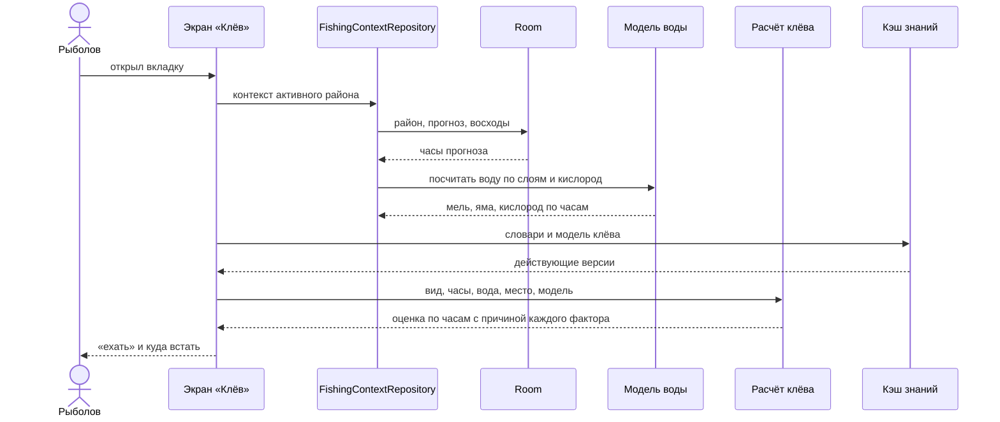
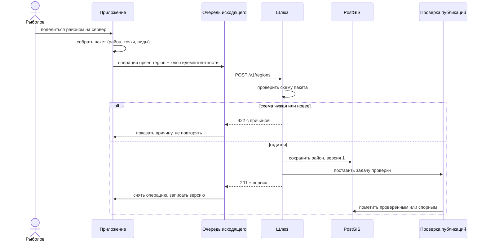
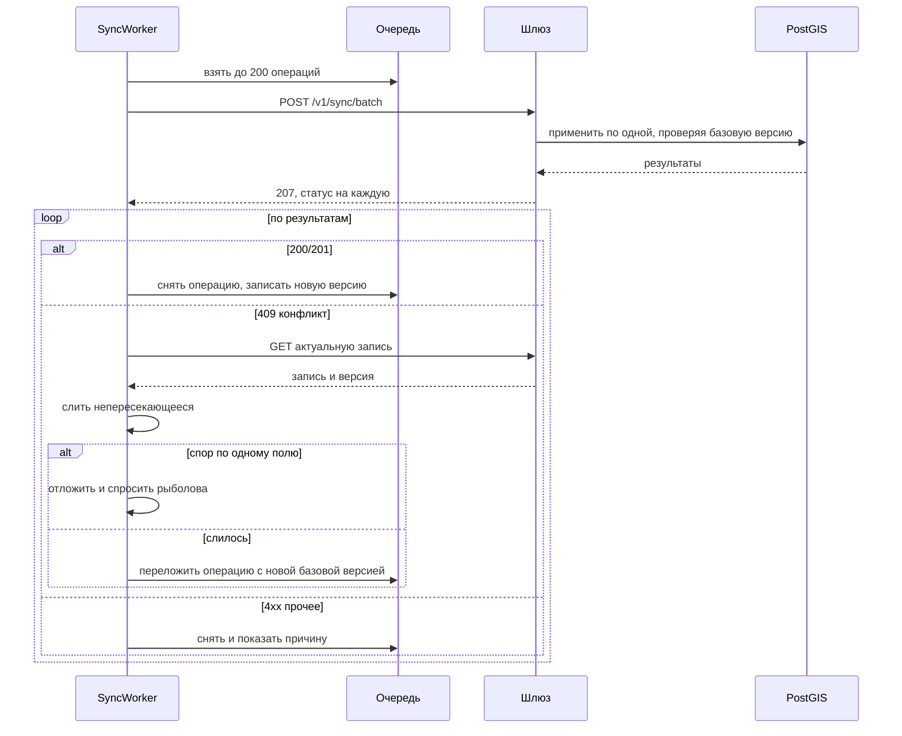
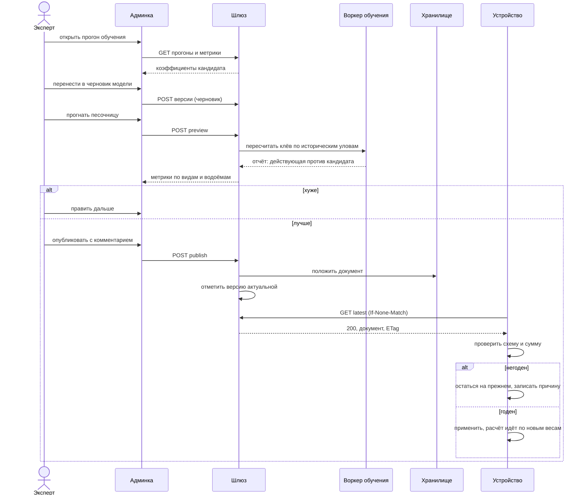
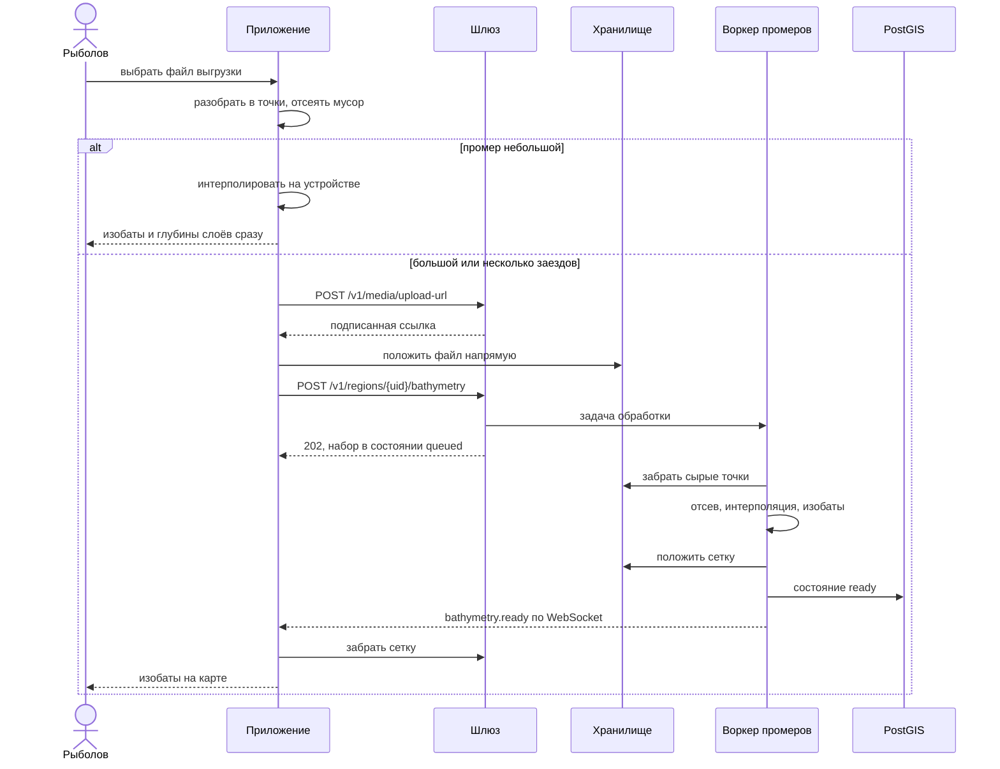
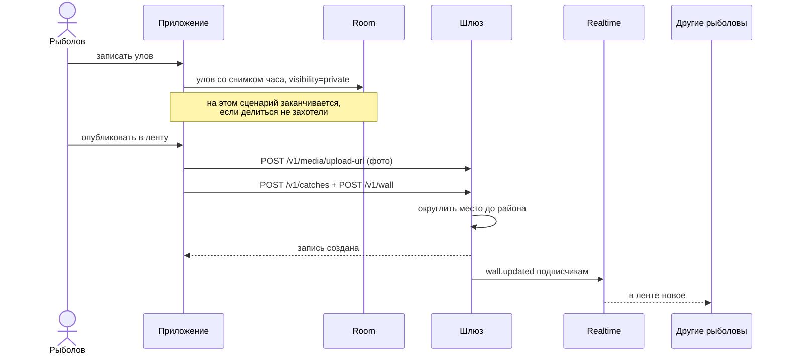
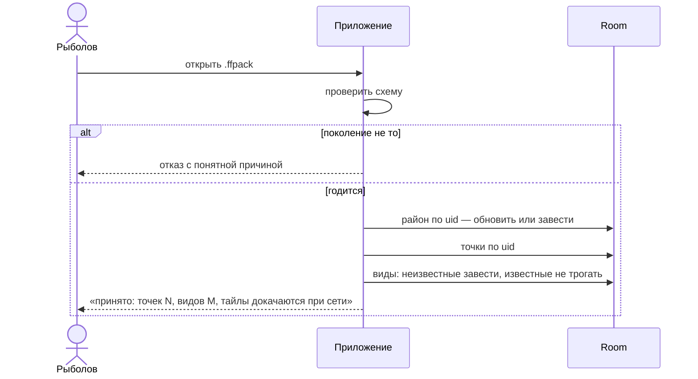

# Диаграммы последовательности

Пошагово — только то, что ломается интереснее всего: обмен между устройством и
платформой, публикация знаний и обработка промеров. Простые чтения сюда не
попали намеренно.

## 1. Решение «ехать или нет» — без сети

Ни одной стрелки наружу. Если сеть есть, она работала раньше — когда наполняла
базу.

## 2. Публикация района

## 3. Синхронизация пачкой и конфликт версий

## 4. Выпуск новой модели клёва

## 5. Промер эхолота

## 6. Улов в ленте

## 7. Приём чужого района файлом

Сервер в этом сценарии не участвует вовсе — и не должен.
