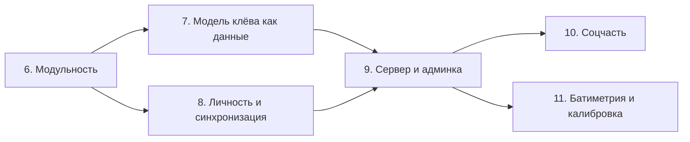

# Фазы 6–11

Фазы 1–5 закрыты и описаны в [Roadmap.md](../Roadmap.md): базис и знания,
метео-интеллект, офлайн-карты, аналитическое ядро, экосистема рыболова. Здесь —
то, что превращает приложение в систему.

Порядок не случаен: каждая следующая фаза опирается на границы, проведённые
предыдущей. Соцчасть без личности и очереди исходящего превращается в
переписывание данных, а калибровка без полного снимка условий у улова считает по
воздуху.

## Фаза 6. Модульность

**Зачем сейчас.** Пока всё в одном модуле, формат обмена знает про Room, а общее
знание нельзя отделить от UI.

Состав:

- Разделение на `:core-domain`, `:core-knowledge`, `:core-bitescore`,
  `:core-ffpack`, `:data`, `:feature-*`, `:app` — см.
  [client/overview.md](client/overview.md).
- Вынос отображения «документ ↔ строка базы» из `:core-knowledge` в `:data`.
- Обновление зависимостей (Kotlin, AGP, Compose — версии осени 2024).

**Готово, когда:** сборка проходит, все существующие тесты зелёные, поведение не
изменилось ни в одном экране, `:core-*` не зависят от Android.

## Фаза 7. Модель клёва как данные

**Зачем сейчас.** Без документа модели админка нечего публиковать, а калибровке
некуда возвращать результат.

Состав:

- Схема `fishforecast.bite-model/1` и кодек рядом с существующими.
- Чтение весов и порогов из документа вместо констант; первая версия повторяет
  нынешние значения.
- Тест-векторы: набор «вход → ожидаемая оценка», по которым сверяются версии.
- Раздел справочника, показывающий действующие веса и версию.
- Запись версий словарей и модели рядом с уловом.

**Готово, когда:** подмена документа меняет расчёт, встроенный документ даёт в
точности прежние числа, тест-векторы проходят.

## Фаза 8. Личность и синхронизация

**Зачем сейчас.** Это фундамент и для соцчасти, и для датасета.

Состав:

- `uid` у улова и полный снимок условий: вода, кислород, фаза света, слой,
  структуры, версии документов.
- Очередь исходящего `sync_outbox`, воркер синхронизации, идемпотентность.
- Разрешение конфликтов по версии района, экран спорных случаев.
- Учётная запись поверх анонимного идентификатора автора.
- Выбор видимости у улова и района.

**Готово, когда:** запись, сделанная в авиарежиме, доезжает до сервера после
включения сети; повторная отправка не создаёт дублей; конфликт версий
разрешается без потери данных.

## Фаза 9. Сервер и админка

**Зачем сейчас.** Знание начинает обновляться без сборки приложения.

Состав:

- FastAPI по контракту [server/api/openapi.yaml](server/api/openapi.yaml):
  личность, знания, районы, синхронизация, файлы.
- PostgreSQL + PostGIS, миграции, бэкапы.
- Публикация и раздача документов знаний с ETag.
- Админка: редактор, различия, песочница, публикация, аудит.
- Логирование с correlation-id и базовые метрики
  ([server/runbook.md](server/runbook.md)).

**Готово, когда:** эксперт публикует новую версию словаря и она приезжает на
телефон без обновления приложения; негодный документ не ломает расчёт.

## Фаза 10. Соцчасть

**Зачем сейчас.** Это то, что видит пользователь, и то, ради чего он вернётся.

Состав:

- Стена уловов с местом до района.
- Чаты: район, группа, личные; WebSocket на приём, REST на отправку.
- Серверный реестр районов: поиск по охвату и названию, вес автора.
- Модерация и жалобы.

**Готово, когда:** улов публикуется отдельным действием, приватный остаётся
приватным, чат переживает обрыв связи без потери сообщений.

## Фаза 11. Батиметрия и калибровка

**Зачем сейчас.** Замыкает контур: данные пользователей → модель → клиент.

Состав:

- Импорт промеров, интерполяция, изобаты, глубины слоёв из сетки —
  [client/bathymetry.md](client/bathymetry.md).
- Витрина датасета, обучение, отчёты качества —
  [server/ml-pipeline.md](server/ml-pipeline.md).
- Выпуск коэффициентов через песочницу и публикацию.
- Поправки по типу водоёма, затем по району.

**Готово, когда:** выпущенная версия коэффициентов измеримо лучше предыдущей на
отложенной выборке, и это видно в отчёте до публикации.

## Что остаётся за рамками фаз

- Разбор проприетарных форматов эхолотов.
- Обучение на устройстве ([ADR-0004](adr/0004-no-on-device-ml.md)).
- Свой хостинг тайлов — отдельная задача с лицензионной, а не технической
  сложностью; условие публикации записано в [Roadmap.md](../Roadmap.md).
- Офлайн-геокодинг: нужен отдельный индекс, он не связан с этими фазами.
