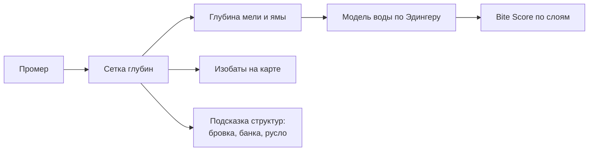
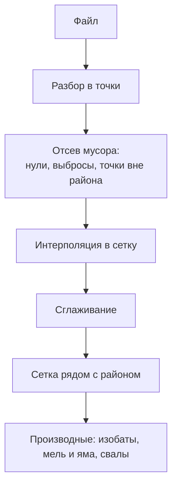

# Слой глубин

Батиметрии прудов и малых озёр нет ни в одном открытом источнике — это записано
в [bite-score.md](bite-score.md) как причина, по которой глубины
вводятся руками. Но у рыболовов есть эхолоты, и каждый выезд с беспроводным
датчиком — это готовый промер, который сейчас пропадает.

## Зачем это модели, а не только глазу

Изобаты на карте — половина пользы. Вторая половина в том, что глубина задаёт
инерцию слоя воды: при полутора метрах постоянная времени около двух суток, при
пяти — около недели. Пока глубины вводятся на глаз, точность модели воды
упирается в память рыболова.

## Откуда берутся данные

| Источник | Формат | Как попадает |
|---|---|---|
| Беспроводной эхолот (Deeper и подобные) | Выгрузка CSV или GPX с глубиной в точке | Файл из приложения производителя |
| Картплоттер (Lowrance, Garmin) | Собственные форматы записи, экспорт в CSV | Файл с карты памяти |
| Ручной промер | Маркерный груз, глубина в точке | Ввод на карте |
| Чужой район | Сетка внутри пакета района | Обмен файлом или через реестр |

Приложение принимает **точки «широта, долгота, глубина»**. Разбор проприетарных
форматов в себя не тянем: пользователь выгружает то, что его эхолот и так умеет
отдавать. Это же правило действует и для GPX — парсер треков уже есть
(`domain/share/GpxParser.kt`).

## Конвейер обработки

**Интерполяция.** По умолчанию — обратные взвешенные расстояния (IDW) по сетке с
шагом от 2 до 10 метров в зависимости от плотности промера. Метод выбран за
предсказуемость: он не выдумывает ям там, где точек нет, а честно размазывает
известное. Ячейки дальше заданного радиуса от ближайшей точки остаются пустыми —
пустая ячейка честнее выдуманной глубины.

**Где считается.** Малый промер (тысячи точек) считается на устройстве: это
секунды, и работает без сети. Большой промер и объединение нескольких заездов
уходят в серверный воркер, который вернёт готовую сетку.

## Хранение

| Что | Где | Формат |
|---|---|---|
| Сырые точки | Файл приложения, при публикации — объектное хранилище | Как пришло |
| Сетка | Файл рядом с районом, запись в `bathymetry_grids` | Компактный бинарный слепок сетки |
| Изобаты | Считаются из сетки при отрисовке | GeoJSON в памяти |
| Метаданные | Room и PostGIS | Шаг сетки, охват, диапазон глубин, автор, дата |

Сетка не кладётся в Room построчно: это не данные для выборок, а слепок, который
читается и пишется целиком. То же решение, что и со словарями знаний.

## Отрисовка

Изобаты рисуются линиями поверх базового слоя, заливка между ними — по шкале
глубин, полупрозрачно: под ней должно быть видно берег и рельеф. Слой
переключается, как схема и спутник.

## Связь с расчётом

1. По сетке считаются **глубина мели и глубина ямы** района — те самые, которые
   сегодня вводит человек. Введённое вручную значение остаётся главнее: факт
   всегда точнее расчёта, и это правило уже действует для замера воды.
2. Резкие перепады подсказывают **структуры**: свал, банку, затопленное русло.
   Приложение предлагает их как структуры точки, а не проставляет само —
   решение остаётся за рыболовом.
3. Глубина под конкретной точкой уточняет, к какому слою она относится.

## Приватность

Промер — такой же секрет, как точка: он показывает, где искали и что нашли. По
умолчанию остаётся на устройстве, уезжает только с публикацией района и с той же
видимостью, что и точки.

## Чего здесь нет намеренно

- **Автоматической загрузки промеров из сторонних сервисов.** Условия
  использования чужих карт глубин разные, и разбираться с ними надо до, а не
  после.
- **Разбора проприетарных форматов записи.** Экспорт умеет сам эхолот.
- **Трёхмерной отрисовки.** Красиво, но решение «куда встать» не меняет.
