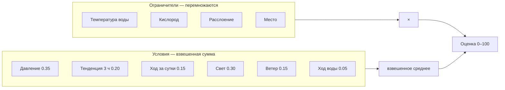

# Клёв: модель, данные и пробелы

Всё о том, как приложение отвечает на вопрос «ехать или нет»: что оно считает,
из чего, какими числами и чего ему для этого не хватает. Три документа —
описание расчёта, чек-лист данных и разбор пробелов — сведены здесь в один,
потому что порознь они начали расходиться друг с другом.

Расчёт идёт **на устройстве, без сети**, по данным, которые уже лежат в Room.
Одинаковый вход всегда даёт одинаковый выход, и каждый фактор возвращает
пояснение: оценка без причины не проверяется, а рыбалка — это проверка.

| Что нужно | Раздел |
|---|---|
| Как устроена модель в двух словах | [Модель в двух словах](#модель-в-двух-словах) |
| Формула и все факторы с порогами | [Общая формула](#общая-формула), [Факторы](#факторы) |
| За какой срок берётся каждая величина | [Окна времени](#окна-времени) |
| Числовой прогон | [Пример](#пример) |
| Что уже учтено и чего нет | [Что учтено](#что-учтено), [Чего нет и почему](#чего-нет-и-почему) |
| Откуда взяты пороги видов и коэффициенты | [Откуда взяты числа](#откуда-взяты-числа) |
| Какие данные хранятся и показаны | [Данные приложения](#данные-приложения) |
| Что и где чинить дальше | [Где брать недостающее](#где-брать-недостающее) |

## Модель в двух словах

1. **Давление** действует на плавательный пузырь. Рыба реагирует не на цифру,
   а на отклонение от привычного ей фона и на направление движения. Норма —
   свойство водоёма, общей цифры не существует.
2. **Кислород** обратно связан с температурой воды: прогрелась — дышать
   нечем, остыла — рыба ожила. Напрямую не измеряется, оценивается косвенно.
3. **Температура воды** задаёт обмен веществ и, значит, потребность в еде.
   Оптимум у каждого вида свой: белому амуру 25–30 °C — праздник, карпу в той
   же воде уже не хватает кислорода.

Отсюда следствия, которые и превращают погоду в решение:

- ветер гонит воду в берег — на наветренном мелководье малый объём воды
  перемешивается и остывает быстрее, там больше кислорода;
- глубина инертна: у дамбы вода остывает позже мелководья, поэтому рыба может
  туда уйти пережидать жару и при этом не питаться;
- после жары важен не сам факт похолодания, а то, что вода начала остывать;
- в одну и ту же погоду разные виды ведут себя по-разному — прогноз без
  привязки к виду бесполезен.

## Что на входе

| Данные | Откуда | Обязательны |
|---|---|---|
| Почасовой прогноз: температура воздуха, давление, ветер со скоростью и направлением, облачность, радиация, осадки | Open-Meteo, кэш `weather_forecast` | Да |
| Норма давления района | Считается при сохранении карты по 70 суткам наблюдений или по высоте места | Нет: без неё давление не оценивается |
| Температура воды по слоям и кислород | Модель Эдингера по тому же прогнозу, глубины мели и ямы у района | Нет: без них расчёт идёт по воздуху |
| Восход и закат | `daily_sun` | Нет: без них фактор света отсутствует |
| Профиль вида: оптимум и предел температуры, пороги кислорода, гильдия, профиль света | Справочник видов | Да |
| Место: слой и структуры точки | `PlaceContext`, собирается из сохранённой точки и словаря | Нет: по умолчанию мель без особенностей |

## Какой прогноз запрашивается

Один вызов `api.open-meteo.com/v1/forecast` на район, по его центру:

```
hourly = temperature_2m, relative_humidity_2m, weather_code, surface_pressure,
         wind_speed_10m, wind_direction_10m, wind_gusts_10m, precipitation,
         precipitation_probability, cloud_cover, shortwave_radiation
daily  = sunrise, sunset
past_days = 7,  timezone = auto
```

Вперёд приходит неделя, назад — семь суток. Прошлое нужно не ради истории: на
нём разгоняется модель воды, и по нему же читаются суточный ход давления и ход
воды. Давление берётся **станционное** (`surface_pressure`), а не приведённое к
уровню моря: барометр телефона показывает именно его, а под Москвой разница
между ними 14 мм рт. ст.

## Норма давления района

Отдельный запрос, только давление, на всю доступную историю:
`past_days=92`, `forecast_days=1`. Модель хранит около семидесяти суток, дальний
край приходит пустым — это учтено.

```
норма = среднее по ряду наблюдений, если непустых часов ≥ 336 (14 суток)
      = давление стандартной атмосферы на высоте района, если ряда нет
```

Порог в четырнадцать суток стоит не случайно: короткий ряд усредняет не норму, а
погоду текущей недели. Запасной вариант по высоте даёт под Москвой (152 м)
746 мм против 746 по наблюдениям — разница в пределах округления.

Норма считается **один раз, в момент сохранения района**: тайлы как раз
качаются, значит сеть есть. Дальше она хранится у карты и не пересчитывается,
поэтому карта, сохранённая дома и увезённая на воду, приезжает туда с нормой.
Нормы нет вовсе — давление и тенденция не оцениваются, а не подменяются
диапазоном вида: норма это свойство места.

## Общая формула

```
ограничители = Π vᵢ (limiting) × бонус места
условия      = Σ (wⱼ · vⱼ) / Σ wⱼ
оценка       = round(ограничители × условия × 100), 0..100
```

Разница между двумя группами принципиальна:

- **Ограничители перемножаются.** Непригодную для рыбы воду не искупает ни
  давление, ни ветер: если дышать нечем, всё остальное не имеет значения.
- **Условия складываются с весами** и лишь распределяют то, что осталось
  возможным.



## Факторы

| Фактор | Роль | Вес | Окно истории | Нет данных |
|---|---|---|---|---|
| Температура воды | Ограничитель | — | час | Считается по воздуху |
| Кислород | Ограничитель | — | 3 ч | Считается по воздуху |
| Расслоение | Ограничитель | — | текущий час, по разнице слоёв | Фактора нет в списке |
| Замечено | Ограничитель | — | срок наблюдения | Фактора нет в списке |
| Место | Ограничитель | — | — | Бонус 1.0 |
| Давление | Условие | 0.35 | час | Фактор равен 1.0 |
| Тенденция | Условие | 0.20 × k вида | окно вида, 1–24 ч | Фактор равен 1.0 |
| Акклимация | Правит оптимум | — | 7 суток, минимум 24 ч | Оптимум не сдвигается |
| Ход за сутки | Условие | 0.15 | 24 ч, минимум 6 | Фактор равен 1.0 |
| Свет | Условие | 0.30 | час | Фактора нет в списке |
| Ветер | Условие | 0.15 | 6 ч | — |
| Ход воды | Условие | 0.05 | 6 ч | Фактора нет в списке |

**Веса не нормированы по единице намеренно.** Сумма сырых весов 1.20, а расчёт
делит на сумму тех весов, которые удалось посчитать. Поэтому отсутствие данных о
восходе не роняет оценку на треть — оставшиеся факторы просто делят вес между
собой. Действующие доли при полном наборе: давление 0.29, тенденция 0.17, ход за
сутки 0.13, свет 0.25, ветер 0.13, ход воды 0.04.

Общая вспомогательная функция затухания:

```
falloff(расстояние, допуск) = clamp(1 − расстояние / допуск, 0, 1)
```

### Температура воды — ограничитель

У вида два диапазона: оптимум и предел выносливости. В оптимуме — единица, между
оптимумом и пределом активность линейно тает, за пределом её нет.

```
t в [optMin, optMax]          → 1.0
t < optMin                    → falloff(optMin − t, optMin − absMin)
t > optMax                    → falloff(t − optMax, absMax − optMax)
```

Ширина перехода у каждого вида своя: карась терпит остывание до градуса, налим в
двадцати двух уже задыхается. Поэтому падение считается от собственного предела
вида, а не от общей константы.

Температура берётся из модели воды нужного слоя плюс поправка структур
(донный ключ холодит место на 3 °C). Воды нет — берётся воздух, и фактор так и
называется: «Температура», а не «Температура воды».

### Кислород — ограничитель

Датчика нет, поэтому считается по воде. Растворимость — функция температуры
(Бенсон — Краузе): 14.6 мг/л при 0 °C, 11.3 при 10, 9.1 при 20, 8.2 при 25,
7.5 при 30. Насыщение умножается на аэрацию водоёма, поправляется ветровым
перемешиванием и уменьшается на ночной провал; структуры добавляют своё —
приток +0.5 мг/л, гнилой ил −1.5.

```
база = 1.0                                    при O₂ ≥ комфорт вида
     = 0                                      при O₂ ≤ критический
     = (O₂ − критический) / (комфорт − критический)   между ними

жара = falloff(вода − optMax, 12 °C)
значение = clamp(min(база, жара) + ход, 0, 1)
```

Порог берётся у вида: карасю хватает 0.5 мг/л, судаку нужно 4. Отдельно
учитывается **жара**: прогретая вода бьёт по рыбе раньше, чем растворимость
дойдёт до её порога, потому что с теплом растёт и собственная потребность.

Слагаемое `ход` — ±0.3 при движении воды на 0.3 °C за 3 часа, и оно работает
**только при воде выше optMax − 2 °C**. В пятиградусной воде кислорода почти
тринадцать миллиграммов на литр: полградуса прогрева там ничего не отнимают, и
штрафовать за них значило бы выдавать весну за ухудшение.

### Расслоение — ограничитель, появляется редко

Условие: слои разошлись на три градуса и больше **и** вода на мели выше оптимума
вида. Тогда столб распался, и рыба уходит из верхнего слоя.

```
расслоение = мель − яма ≥ 3 °C
мель ×0.80, если при этом мель горячее оптимума вида
```

Критерий тот же, что и у кислорода ямы: слои модель и так считает, и гадать по
шести часам штиля, как было раньше, больше не нужно.

**Яму фактор не штрафует.** Её беду — задохнувшийся гиполимнион — считает
кислород своего слоя; множитель сверху наказал бы её дважды за одно и то же.

Перемешанный столб расслоения не даёт, сколько бы ни держалась жара.

### Замечено — ограничитель, живёт по своему сроку

Отметка рыболова о том, что видно с берега: бой малька, птицы над водой,
радужная плёнка, ряска в углу. Эффект и срок берутся из словаря наблюдений.

```
затухание = 1 − прошло / срок           в пределах срока, иначе фактора нет
значение  = clamp(1 + Σ эффект · затухание, 0.4, 1.6)
```

Часы до отметки наблюдение не трогает: оно рассказывает о том, что уже
произошло. Гильдия соблюдается — бой малька касается хищника, гниение всех.
Множится с остальными ограничителями, а не складывается с условиями: увиденный
бой не «добавляет баллов», он говорит, что рыба здесь и сейчас кормится.

### Место — ограничитель

```
бонус = clamp(1 + Σ бонусов структур для гильдии, 0.4, 1.6)
```

Коряжник хищнику +0.25, мирной рыбе +0.1; заводь наоборот; гнилой ил обоим
−0.3. Даже самое гиблое место не обнуляет шанс полностью, и самое рыбное не
заменяет собой погоду.

### Давление — вес 0.35

Отсчёт идёт от **нормы конкретного водоёма**, а не от общей цифры: рыба
привыкает к фону своего места.

```
допуск   = maxDropMmHg вида, если давление ниже нормы
         = maxRiseMmHg вида, если выше
значение = falloff(|P − норма|, допуск)
```

Допуск берётся у вида и **несимметричен**: падение рыба переносит легче роста —
падающее давление она встречает кормлением, растущее вгоняет в апатию. У карася
это 14 мм вниз и 12 вверх, у судака 7 и 6.

Абсолютных границ у вида нет намеренно. Прежние 740–755 описывали равнину и
врали везде, где высота другая: на 500 м норма около 710 мм, и жёсткая нижняя
граница объявила бы обычный для места фон катастрофой.

Отклонение до 2 мм считается нормой. Нормы нет — фактор равен единице и честно
об этом пишет: подставлять сюда допуск вида не во что, норма это свойство
места.

### Тенденция — вес 0.20, помноженный на память вида

Окно не общее: его задаёт `pressure_recovery_hours` — за сколько часов вид
отыгрывает перепад давления. Открытопузырные (карп, плотва, лещ, щука)
стравливают газ через пищевод и приходят в себя за два-четыре часа;
закрытопузырные (окунь, судак, налим) газообменивают пузырь через кровь, и тот
же перепад держит их в апатии по двенадцать-восемнадцать часов.

Отсюда два следствия. Первое: окно градиента у карпа два часа, у судака
четырнадцать — общее трёхчасовое было для одного слишком длинным, для другого
слишком коротким. Второе: вес тенденции растёт вместе с памятью,
`k = clamp(0.7 + 0.05 · часы, 0.7, 1.6)` — рыба, которая выбирается из перепада
полсуток, зависит от него сильнее.

Величина и время разведены намеренно: **сколько** вид терпит задаёт допуск
(`max_drop_mmhg` / `max_rise_mmhg`), **как долго** помнит — окно отыгрыша.

| Условие | Значение |
|---|---|
| Изменение ≤ 1 мм и мы у нормы | 1.0 |
| Изменение ≤ 1 мм | 0.8 |
| Движение к норме | 0.9 |
| Изменение ≤ 3 мм | 0.5 |
| Больше | 0.2 |

Возврат к норме рыба встречает оживлением, уход в сторону — наоборот, поэтому
одинаковый по величине скачок оценивается по-разному.

### Ход за сутки — вес 0.15

Окно 24 часа, минимум 6; меньше истории — фактор равен единице.

| Изменение за сутки | Значение | Смысл |
|---|---|---|
| Падение ≥ 2.5 мм | 1.0 | Перед фронтом, рыба кормится впрок |
| Падение 1–2.5 мм | 0.9 | Понемногу падает |
| В пределах ±1 мм | 0.9 у нормы, иначе 0.8 | Сутки ровные |
| Рост ≥ 4 мм | 0.35 | Резкий рост после фронта |
| Рост, но давление у нормы | 0.65 | Фон привычный, меняется сторона |
| Прочий рост | 0.5 | Клёв вялый |

Прямой связи давления с кормлением наука не показала: в поле его не отделить от
остальной погоды. Это эвристика, и потому она весит меньше отклонения от нормы.

### Ход воды — вес 0.05

Окно 6 часов, шаг 0.3 °C. Знак зависит не от направления, а от того, с какой
стороны от оптимума стоит вода.

| Положение | Греется | Стынет | Стоит |
|---|---|---|---|
| Ниже оптимума | 1.0 | 0.55 | 0.8 |
| Выше оптимума | 0.5 | 1.0 | 0.75 |
| В оптимуме | 0.9 | 0.9 | 1.0 |

### Ветер — вес 0.15

Основа — скорость:

| Скорость | Значение |
|---|---|
| < 1.5 м/с | 1 − бонус ряби: 0.75 хищнику, 0.90 мирной |
| 1.5–5 м/с | 1.0 |
| 5–9 м/с | 0.7 |
| > 9 м/с | 0.3 |

Дальше множители по истории за 6 часов и по стороне:

| Условие | Множитель |
|---|---|
| Развернулся на ≥ 90° | ×0.8 |
| Держит сторону в пределах 45° | ×1.1 |
| Северный (315–45°) и вода ниже оптимума | ×0.85 |
| Северный и вода выше оптимума | ×1.1 |

Штиль «не разворачивается»: у слабого ветра направление случайно, поэтому
множители применяются только от 1.5 м/с. Итог зажимается в 0..1.

### Свет — вес 0.30

Фазы считаются от восхода и заката, а не от часов: летний рассвет в четыре и
зимний в девять — это одна фаза. Зори — окна ±45 минут вокруг события.

Значение берётся из профиля вида (`light_activity` в справочнике), а если его
нет — из профиля гильдии: у хищника пики на зорях, у мирной рыбы активность
размазана по светлому времени. Без данных о восходе фактор не участвует вовсе.

## Окна времени

| Что считается | Окно | Почему столько |
|---|---|---|
| Температура воды, кислород, свет, скорость ветра | текущий час | Это состояние, а не ход |
| Кислородный ход | 3 ч | Столько же, сколько у тенденции давления: они читаются вместе |
| Тенденция давления | окно вида, 1–24 ч | Карп отыгрывает перепад за два часа, судак за четырнадцать |
| Ход давления за сутки | 24 ч, минимум 6 | Жор идёт за 12–24 ч до фронта; при меньшей истории фактор молчит |
| Ход воды | 6 ч | Вода инертна: за три часа её движение не отличить от шума |
| Постоянство и разворот ветра | 6 ч | Нагон корма к берегу требует часов, а не минут |
| Расслоение | текущий час | Считается по разнице слоёв, а не по погоде: слои модель и так знает |
| Акклимация | 7 суток, минимум 24 ч | Столько длится основная часть перестройки обмена |
| Разгон модели воды | 7 суток назад | Ошибка начального значения затухает за 3–5 постоянных времени |
| Норма давления | 14–92 суток | Меньше двух недель — это погода, а не фон места |

## Температура: четыре разных масштаба

Вопрос «за сколько времени брать температуру» не имеет одного ответа, потому что
она действует на рыбу четырьмя способами сразу, и у каждого своё окно.

| Масштаб | Что происходит | В модели |
|---|---|---|
| **Час** | Обмен веществ. С теплом растут скорость пищеварения и потребность в еде: карп при 6 °C съедает сотые доли процента массы в сутки, при 24 °C выходит на максимум; лещ ниже 13 °C почти прекращает питаться | ✅ ограничитель по текущей воде |
| **6–24 часа** | Шок перемены. Резкое падение останавливает питание на 12–72 часа независимо от абсолютного значения; прогрев после холода, наоборот, запускает | ✅ ход воды, окно 6 ч |
| **3–14 суток** | Акклимация. Рыба перестраивает обмен под температуру, в которой стоит: акклимированная к 25 °C ест почти вдвое интенсивнее акклимированной к 15 °C. Сдвиг начинается уже за сутки и в основном укладывается в первую неделю | ✅ окно 7 суток, сдвиг оптимума |
| **Недели и месяц** | Накопленное тепло: сумма градусо-дней определяет нерест, посленерестовый провал, осенний жор | ❌ не учитывается |

**Практический вывод: недостающее окно — семь суток.** Оно сходится сразу с трёх
сторон. Большая часть акклимации проходит за первую неделю. Инерция самой воды
того же порядка: при полутора метрах постоянная времени около двух суток, при
пяти — около недели. И семь суток прошлого приложение уже качает — брать их
неоткуда не надо.

Месяц для клёва избыточен: он про сезон и нерест, а не про сегодняшний выезд.
Трёх суток мало — они не покрывают акклимацию и повторяют то, что уже говорит
шестичасовой ход воды.

**Как это устроено.** Средняя вода своего слоя за семь суток — температура
акклимации. Полоса комфорта сдвигается к ней:

```
сдвиг = clamp((акклимация − середина оптимума) × 0.3, −2 °C, +2 °C)
оптимум = [optMin + сдвиг, optMax + сдвиг]
```

Берётся не весь разрыв, а его доля, и сдвиг ограничен парой градусов: вид
остаётся собой, месяц ледяной воды не превращает щуку в налима. **Предел
выносливости не сдвигается** — привычка меняет аппетит, а не физиологию.

Меньше суток истории — сдвига нет: первые часы прогноза не должны выглядеть
иначе только потому, что смотреть назад ещё некуда. Когда сдвиг заметен, он
назван в пояснении: «рыба привыкла к холодной воде».

## Модели, на которые опирается расчёт

**Вода** — уравнение равновесной температуры Эдингера, шаг час:

```
Te = T_точки_росы + SWnet / K
K  = 4.5 + 0.05·Tw + (β + 0.47)·(9.2 + 0.46·w²)
τ  = ρc·h / K,  ρc = 4.186·10⁶
Tw ← Tw + (Te − Tw)·(1 − e^(−3600/τ))
```

Считается для двух глубин: мель и яма района. Отсюда инерция — при 1.5 м τ около
двух суток, при 5 м около недели. Замер термометром, если он есть, переставляет
модель на факт.

**Кислород** — насыщение по Бенсону — Краузе, поправленное аэрацией водоёма,
ветровым перемешиванием и ночным провалом (1.5 мг/л в малом пруду, 0.5 в
большом, 0 на реке).

Считается **отдельно для каждого слоя**. Пока столб перемешан, яма дышит вместе
с мелью и разница только в температуре. Но когда слои расходятся на три градуса
и больше, между ними встаёт термоклин: ветер до ямы не достаёт, дневного
кислорода от водорослей там нет, а донные отложения продолжают его тратить.

```
расслоение = мель − яма ≥ 3 °C
кислород ямы = насыщение(вода ямы) × аэрация − расход · часы расслоения / 24
```

Расход берётся у типа водоёма: полтора миллиграмма в сутки в малом пруду,
0.8 в большом озере, 0.2 на малой реке, ноль на большой. Литература даёт для
гиполимниона от 0.02 до 2.0 мг/л в сутки — продуктивный пруд стоит в верхней
части этого разброса.

Отсюда и рыба в термоклине: наверху жарко, внизу нечем дышать, и она стоит
между. Раньше расчёт брал для ямы кислород мели и завышал её шансы ровно там,
где рыбы нет.

## Пример

Карп, вода 19 °C, кислород 8.3 мг/л, давление 753 при норме 758, за сутки −1 мм,
ветер юго-западный 4.0 м/с шестой час, вечер. Истории меньше суток, поэтому
оптимум не сдвинут.

```
Ограничители:
  температура  19 < optMin 20 → falloff(1, 20−5=15) = 0.93
  кислород     8.3 ≥ комфорт 5.0 → 1.0
  место        мель без особенностей → 1.0
  итого        0.93

Условия (в скобках вес):
  давление     falloff(5, допуск карпа вниз 12) = 0.58   (0.35)
  тенденция    окно карпа 2 ч, стабильно, не у нормы = 0.80
               вес 0.20 × (0.7 + 0.05·2) = 0.16          (0.16)
  ход за сутки −1 мм → 0.90                              (0.15)
  свет         вечер, профиль карпа 0.90                 (0.30)
  ветер        1.0, держит сторону ×1.1 → 1.0            (0.15)
  ход воды     ниже оптимума, греется = 1.0              (0.05)
  сумма весов  1.16
  итого        (0.204+0.128+0.135+0.27+0.15+0.05) / 1.16 = 0.81

Оценка: 0.93 × 0.81 × 100 ≈ 75
```

Видно, зачем нормировка: у карпа тенденция весит 0.16 вместо 0.20, сумма весов
не единица, и без деления на неё оценка просела бы просто от того, что рыба
быстро отыгрывает давление.

## Правила принятия решений

Проверять по каждому выезду. Отметка — реализовано ли правило в приложении.

1. Давление идёт **к норме** водоёма → активность растёт. ✅
2. Давление уходит **от нормы** или скачет → активность падает. ✅
3. Жара держалась несколько дней, начинается похолодание → вода остывает и
   насыщается кислородом, ждать оживления. ✅ неделя истории плюс ход воды.
4. Вода прогрета выше комфорта вида → активность падает до нуля независимо
   от давления. ✅ ограничитель по кислороду, теперь от настоящей воды.
5. Ветер дует в берег → идти на наветренное мелководье. ❌ нужен контур
   водоёма; направление ветра уже есть.
6. Днём в жару рыба уходит на глубину, но там ещё не остыло → клёва нет,
   ловить на глубине бессмысленно. ⚠️ обе кривые воды видны рыболову, но
   вывод он делает сам: оценка клёва считается по мели.
7. Вид рыбы решает: в прогретой воде амур активен, карп нет. ✅
8. Зори и смена света → окна клёва. ⚠️ восход и закат показаны, в оценку
   пока не входят.
11. Давление падало сутки → рыба кормится впрок перед фронтом; резко выросло →
    клёв замирает на сутки-полтора. ✅ суточное окно с минимумом в шесть часов.
12. Было холодно и потеплело → рыба выходит кормиться; в перегретой воде тот же
    прогрев работает наоборот. ✅ ход воды считается относительно оптимума вида.
13. Ветер сутки дует в один берег → корм у наветренного; ветер развернулся →
    рыба перестраивается и берёт хуже. ✅ сравнение направления за шесть часов.
14. Штиль в жару → вода расслоилась, рыба в термоклине: мель теряет больше, чем
    яма. ✅
9. За кем едут — за стаей или за одиночкой — меняет не оценку клёва, а стол
   и насадку: ковёр мелкой фракции против точки и крупного сушёного бойла.
   ✅ вопрос задаётся в сборах, ответ пишется в архив выезда.
10. Вода холодная → любая схема, кроме точечной, работает против рыболова:
    рыба ест мало и осматривает точку. ✅

## Что учтено

Список сверен с кодом 04.09.2026: десять факторов расчёта плюс то, что правит их
на входе.

1. **Температура воды** по слоям, модель Эдингера — ограничитель по оптимуму и
   пределу вида.
2. **Акклимация**: оптимум сдвигается к средней воде за семь суток, не дальше
   двух градусов; предел выносливости не двигается.
3. **Кислород** — ограничитель по порогам вида: насыщение по Бенсону — Краузе,
   аэрация водоёма, ветровое перемешивание, ночной провал, поправки структур.
4. **Кислород по слоям**: у ямы свой, с расходом гиполимниона на расслоении.
5. **Расслоение**: мель ×0.80, когда слои разошлись на три градуса и наверху
   жарче оптимума. Яму фактор не трогает — за неё отвечает кислород слоя.
6. **Место**: слой, структуры точки и их поправки к воде и кислороду.
7. **Замечено**: отметки рыболова с затуханием к концу своего срока.
8. **Давление** — отклонение от нормы места, вес 0.35, допуск видовой и
   несимметричный.
9. **Тенденция** — окно вида (1–24 ч), вес 0.20 с множителем по времени
   отыгрыша, с различением «к норме» и «от неё».
10. **Ход давления за сутки** — вес 0.15, окно 24 часа с минимумом в 6.
11. **Свет** — фазы от восхода и заката, профиль вида или гильдии, вес 0.30.
12. **Ветер** — вес 0.15: скорость с оптимумом ряби, постоянство и разворот за
    6 часов, северный сектор со знаком по температуре воды.
13. **Ход воды** за 6 часов относительно оптимума вида, вес 0.05.
14. **Нормировка весов** по посчитанным факторам — нехватка данных не роняет
    оценку.
15. **Причина у каждого фактора** текстом.

## Чего нет и почему

1. ~~Акклимация к воде последней недели~~ — сделано 04.09.2026: оптимум
   сдвигается к средней воде за семь суток, не дальше двух градусов.
2. Сезон и градусо-дни: нерест, посленерестовый провал, осенний жор.
3. ~~Структуры точки~~ — сделано 04.09.2026: структуры выбранной точки идут в
   расчёт на вкладке «Клёв».
4. ~~Наблюдения рыболова~~ — сделано 04.09.2026: отметка с берега действует
   свой срок и тает к его концу.
5. ~~Разная чувствительность видов к давлению~~ — сделано 04.09.2026: допуск
   по величине и окно по времени взяты у вида.
6. Наветренный берег как место — нужен контур водоёма.
7. Собственный барометр — пишется и показывается, в расчёт не идёт.
8. Осадки и мутность.
9. Прозрачность воды и цветение.
10. ~~Кислород одной цифрой на водоём~~ — сделано 04.09.2026: у ямы свой
    кислород с расходом на расслоении.
11. Фаза луны — отвергнута сознательно.
12. Калибровка по журналу уловов.

### Почему именно так

Короткий разбор с проверкой по коду и порядком работ —
разделе «Чего нет и почему».

| Не учитывается | Почему |
|---|---|
| Фаза луны | Влияние на пресноводную рыбу спорное, в модели трёх факторов его нет |
| Осадки и мутность | Хранятся и показываются, в оценку не входят; мутность влияет на выбор приманки, а не на аппетит |
| Наветренный берег как место | Нужен контур водоёма и разгон волны — работа по карте, не по погоде |
| Структуры точки в плане выезда | На вкладке «Клёв» они учитываются; у выезда выбранной точки нет, только слой |
| Собственный барометр | История датчика точнее сетевой, но пока показывается справочно |
| Календарь: нерест, жор перед зимой | Данных о сроках по конкретному водоёму нет |

### Отвергнуто сознательно

- **Фаза луны** — решено не брать. Влияние на пресноводную рыбу спорное, в
  модели трёх факторов его нет, а поле в справочнике только притворялось
  параметром: заполнялось «None» и ни разу не читалось.
- **Магнитное поле, УФ-индекс, «когда мыть машину»** — в модели из источника
  их нет, а на решение о месте они не влияют. Экран должен отвечать на вопрос
  о рыбалке, а не показывать всё, что отдаёт погодный сервис.
- **Температура воздуха как замена температуре воды** — уже используется, но
  это упрощение, а не параметр. Вода инертна: воздух остывает за час, вода —
  за сутки, и на глубине позже, чем на мелководье.

## Разбор замечаний от 04.09.2026

### 1. Абсолютное давление в справочнике — мина, обезврежена

**Замечание.** У каждого вида в `initial_fish.json` жёсткие границы
`min_mmHg: 740, max_mmHg: 755`. На высоте 500 м норма около 710 мм, и алгоритм
сочтёт нормальное для места давление катастрофическим падением.

**Проверка по коду.** Обнуления не происходит: `pressureFactor` считает только
отклонение от нормы района и границы вида не читает вовсе. Их убрали из расчёта
раньше — норма это свойство места, и подставлять вместо неё диапазон рыбы
нельзя. Единственное живое употребление — строка в справочнике видов
(`FishSection.kt:273`), где они показываются рыболову.

**Но замечание по сути верное.** Во-первых, это мина: поле выглядит параметром
модели, и следующий, кто захочет «учесть давление вида», включит его обратно и
получит ровно описанный эффект. Во-вторых, оно уже врёт человеку: рыболов на
высоте 500 м видит у карася «742–758 мм рт. ст.» и свои реальные 710 — и делает
вывод, что его водоём вне диапазона.

**Сделано 04.09.2026.** Поле переведено в допуски от нормы места:
`max_drop_mmhg` и `max_rise_mmhg`. Они не зависят от высоты, показываются в
справочнике как «терпит −12…+10 мм от нормы» и теперь **участвуют в расчёте**:
общий допуск в двенадцать миллиметров заменён видовым и несимметричным. Мина
обезврежена не тем, что поле убрали, а тем, что оно стало значить правду.

Абсолютные `min_mmHg` и `max_mmHg` остались в документе как устаревшие: расчёт
их не читает, но старая сборка, встретив новый справочник, должна его разобрать.
Уйдут вместе с переходом схемы на `/2`.

### 2. Открытопузырные против закрытопузырных — подтверждалось, сделано

**Замечание.** Окно градиента в 3 часа и допуск в 12 мм одинаковы для всех.
Карп и плотва стравливают газ через пищевод за минуты; судак, окунь и налим
газообменивают пузырь через кровь, и перепад стягивает их в апатию на 12–24 часа.

**Проверка по коду.** Так и есть: `TREND_WINDOW_HOURS = 3` и
`PRESSURE_TOLERANCE = 12.0` — константы, общие для всех видов. Ни одного
видового поля про давление в расчёте нет.

**Уточнение по составу.** Из наших десяти видов закрытопузырные — окунь, судак и
налим. Щука, вопреки распространённому мнению, открытопузырная и по давлению
ближе к карпу, чем к судаку.

**Сделано 04.09.2026.** У вида появилось `pressure_recovery_hours`: карп, карась
и плотва 2 часа, лещ и амур 3, щука и сом 4, окунь 12, судак 14, налим 18. Из
него считаются оба: окно градиента и множитель к весу тенденции
(`0.7 + 0.05 · часы`, зажато в 0.7…1.6).

Величина и время разведены: сколько вид терпит — это допуск от нормы из
предыдущей работы, как долго помнит — окно отыгрыша. Чужое значение зажимается
в 1…24 часа: справочник правится руками и приезжает с сервера.

### 3. Мёртвый код структур и наблюдений — подтверждался, структуры починены

**Проверка по коду.** `PlaceContext.structures` заполнялся только пустым
списком: оба вызова передавали лишь слой. Слово `observation` в расчёте не
встречается ни разу — словарь до сих пор читает только экран справочника.

Следствие было ровно такое, как описано: хищник считался «в вакууме чистой
воды». Коряжник даёт щуке +0.25, всплески малька — ещё +0.3 на два часа, и ни то,
ни другое до оценки не доходило.

**Структуры починены 04.09.2026.** `placeOf` собирает место из сохранённой точки
и словаря знаний, вкладка «Клёв» передаёт его в расчёт: выбрал точку — оценка
считается для неё, с её коряжником, бровкой и притоком. Незнакомые
идентификаторы пропускаются молча: словарь правится отдельно от точек.

Справочник видов структуры не получает намеренно — он отвечает на вопрос «за кем
ехать» по району целиком, а не по конкретному месту. План выезда тоже пока без
них: у выезда нет выбранной точки, только слой.

**Наблюдения починены тогда же.** Отметка хранится у района (`observations`,
миграция 21→22), а срок жизни по-прежнему берётся из словаря — копировать его в
базу значило бы копировать знание. Поправка тает линейно: целиком в момент
отметки, ничем к концу срока. Гильдия соблюдается: бой малька касается хищника,
радужная плёнка — всех. Часы до отметки наблюдение не трогает: оно про то, что
уже произошло.

### 4. Рассветный кислород — механизм есть, дыра в другом месте

**Замечание.** Модель покажет высокий клёв карпа на рассвете именно тогда, когда
кислород на суточном минимуме.

**Проверка по коду.** Ночной провал не просто заложен, он разрешён по времени:
`darkHoursBefore` считает, сколько часов подряд перед этим не было солнца (по
приходу радиации, а не по часам), и провал нарастает пропорционально этому
числу. К рассвету он максимален. Кислород — ограничитель, то есть перемножается
с остальным, поэтому пик света на рассвете он и должен гасить. Описанного
парадокса в модели нет.

**Рядом была настоящая дыра, и она закрыта 04.09.2026.** Кислород считался
одной цифрой на водоём — по температуре мелкого слоя. Теперь у ямы свой: пока
столб перемешан, она дышит вместе с мелью, а когда слои расходятся на три
градуса, включается расход гиполимниона — от полутора миллиграммов в сутки в
пруду до нуля на большой реке.

Двойственность, возникшая было в тот же день, устранена: фактор «Расслоение» в
расчёте клёва тоже судит по разнице слоёв, а не по шести часам штиля. Заодно
исчезло двойное наказание ямы — множитель с неё снят, потому что её беду теперь
считает кислород своего слоя.

### Порядок работ и чем он кончился

| № | Работа | Почему в этом порядке | Объём |
|---|---|---|---|
| ~~1~~ | ~~Структуры точки в расчёт~~ | Сделано: `placeOf` собирает место из точки и словаря, вкладка «Клёв» передаёт его в расчёт | — |
| ~~2~~ | ~~Наблюдения со сроком жизни~~ | Сделано: отметка на вкладке «Клёв», затухание к концу срока, множитель к ограничителям | — |
| ~~3~~ | ~~Давление в дельтах от нормы~~ | Сделано: допуск видовой, несимметричный, показ через отклонение | — |
| ~~4~~ | ~~Чувствительность к давлению по виду~~ | Сделано: окно градиента и вес тенденции берутся у вида | — |
| ~~5~~ | ~~Кислород по слоям~~ | Сделано: расход гиполимниона по типу водоёма, критерий — разница слоёв | — |
| ~~7~~ | ~~Один критерий расслоения~~ | Сделано: оба судят по разнице слоёв, с ямы снят двойной штраф | — |
| ~~6~~ | ~~Акклимация за неделю~~ | Сделано: сдвиг оптимума к средней воде за семь суток | — |

Все семь работ закрыты 04.09.2026. Порядок был выбран так, чтобы сперва донести
до расчёта уже посчитанное и только потом менять предположения модели: первые
две работы не добавили ни одного нового допущения, третья чинила показ, и лишь
четвёртая, пятая и шестая тронули физику.

Что осталось в списке неучтённого, требует либо новых данных (контур водоёма,
прозрачность, сроки нереста), либо сервера (калибровка по журналу уловов).

## Данные приложения

Колонки: **Хранится** — попадает ли в базу устройства и переживает ли потерю
сети; **Показано** — видно ли рыболову; **Учтено** — участвует ли в расчёте
Bite Score.

### Погода и вода

| Параметр | Зачем нужен | Источник | Хранится | Показано | Учтено |
|---|---|---|---|---|---|
| Атмосферное давление | Главный фактор; пузырь рыбы | ✅ `surface_pressure` — станционное, как у барометра | ✅ `WeatherEntity.pressure` | ✅ карточка и график, мм рт. ст. | ✅ `pressureFactor` |
| Норма давления водоёма | Точка отсчёта, без неё цифра бессмысленна | ✅ среднее за 70 суток наблюдений; без сети — по высоте места | ✅ `baselinePressureMmHg` | ✅ пунктир на графике и подпись | ✅ |
| Тенденция давления вперёд | Возврат к норме = рост активности | Прогноз | ✅ (следует из часов) | ✅ «падает на N за 6 ч» | ✅ `pressureTrendFactor`, окно 3 ч |
| История давления за сутки назад | Понять, откуда пришли: «вчера в это время» | ✅ `past_days=7` | ✅ хранится неделя | ✅ «вчера в это время» | ✅ через разгон модели воды |
| Локальный барометр | Проверка прогноза по факту в точке | Датчик устройства | ✅ `barometer_log`, неделя по часам | ✅ карточка, сутки назад | ❌ пока справочно |
| Температура воздуха | Вход модели воды | Open-Meteo | ✅ | ✅ карточка и график | ⚠️ только когда воды нет |
| Ход температуры | Остывание после жары — момент оживления | Прогноз | ✅ | ✅ график и «вчера в это время» | ✅ через ход воды |
| **Температура воды** | Ключевой параметр модели | ✅ расчёт по модели Эдингера — §2 | ⚠️ считается на лету из прогноза | ✅ карточка и график, мель и яма | ✅ ограничитель вместо воздуха |
| **Кислород** | Второй из трёх факторов | ✅ Бенсон — Краузе от воды — §3 | ⚠️ считается на лету, отдельно для мели и ямы | ✅ мг/л и словами | ✅ ограничитель |
| Скорость ветра | Перемешивание, рябь, комфорт ловли | Open-Meteo | ✅ км/ч | ✅ м/с | ✅ `windFactor` |
| Направление ветра | Выбор берега — главное решение дня | Open-Meteo | ✅ | ✅ румб и стрелка | ⚠️ тепловой вклад уже в модели воды; берег — §4 |
| Порывы ветра | Реальная возможность ловли | ✅ `wind_gusts_10m` | ✅ | ✅ в карточке ветра | ❌ |
| Облачность | Прогрев воды, поведение у поверхности | ✅ `cloud_cover` | ✅ | ✅ % и что это значит | ✅ через радиацию в модели воды |
| Осадки: вероятность | Дождь сбивает жару и добавляет кислород | Open-Meteo | ✅ | ✅ % в ленте и неделе | ❌ |
| Осадки: количество | Ливень меняет воду сильнее, чем морось | ✅ `precipitation` | ✅ | ✅ мм за час | ❌ |
| Солнечная радиация | Вход модели прогрева воды | ✅ `shortwave_radiation` | ✅ | ❌ и не нужно | ✅ вход модели воды |
| Влажность | Слабый фактор, оставлен для полноты | Open-Meteo | ✅ | ✅ | ❌ и не нужно |
| Восход и закат | Зори — главные окна клёва | ✅ `daily=sunrise,sunset` | ✅ `daily_sun` | ✅ карточка | ❌ |

### Водоём и место

| Параметр | Зачем нужен | Статус |
|---|---|---|
| Контур водоёма | Определить наветренный берег | ✅ есть в векторных тайлах, не используется — §4 |
| Глубины, свал, дамба | Отличить инертную глубину от мелководья | ✅ мель и яма вводятся у карты; батиметрии нет нигде |
| Наветренное мелководье | Готовая подсказка «встань здесь» | ❌ считается по контуру и разгону — §4 |
| Сохранённые точки | Личное знание рельефа вместо карты глубин | ✅ `fishing_spots`, своя норма давления |
| Журнал уловов | Калибровка модели по факту | ✅ снимок условий часа |

### Рыба, прикормка, наживка

| Параметр | Зачем нужен | Статус |
|---|---|---|
| Температурный оптимум вида | Карп и амур в одной воде ведут себя по-разному | ✅ оптимум и предел выносливости отдельно: между ними активность тает |
| Акклимация к воде недели | Двенадцать градусов после холодной недели и после тёплой — разные вещи | ✅ оптимум сдвигается к средней воде за семь суток, не дальше двух градусов |
| Порог кислорода вида | Карасю хватает 3 мг/л, налиму нужно 6 | ✅ в справочнике, идёт в ограничитель |
| Допуск вида по давлению | Судак теряет на семи миллиметрах то, что карась терпит на четырнадцати | ✅ допуск от нормы места, несимметричный: падение шире роста |
| Время отыгрыша перепада | Карп стравливает газ за два часа, судак выбирается полсуток | ✅ окно тенденции и её вес берутся у вида |
| **Тип прикормки от температуры воды** | Холодная вода — меньше объём, меньше сладости | ✅ правила в справочнике, порог холодного стола у каждого вида свой |
| **Объём прикормки от активности** | Пассивной рыбе много корма во вред | ⚠️ объём задан для холодной и тёплой воды; от активности пока не зависит |
| **Наживка от вида и температуры** | Животная в холодной воде, растительная в тёплой | ✅ два списка у каждого вида, экран показывает нужный |
| **Горизонт ловли** | Дно или толща — следует из температуры и кислорода | ⚠️ горизонт вида показан; от условий часа не пересчитывается |
| **Схема закорма** | Тот же корм ковром и точкой зовёт разную рыбу | ✅ словарь схем; выбор по цели выезда, температуре воды и размеру водоёма |
| **Размер и твёрдость насадки** | Единственный отбор, работающий до поклёвки | ✅ приходит вместе со схемой закорма |
| **Монтаж и вес грузила** | Засекает грузило, а не рука | ✅ свойство способа ловли, а не вида |
| **Чего место требует от снасти** | Коряжник — фрикцион и диаметр, ил — длина поводка | ✅ `gear_note` у структуры, виден в плане и в справочнике |

## Откуда взяты числа

### Откуда взяты механизмы динамики

Четыре механизма динамики — суточный ход давления, ход воды, постоянство ветра и
расслоение — опираются на литературу, а не на догадку:

| Механизм | Окно | Что делает | На чём основано |
|---|---|---|---|
| **Ход давления за сутки** | 24 ч, минимум 6 | Падение перед фронтом — в плюс, резкий рост после него — в минус | За 12–24 ч до фронта, на падающем давлении, идёт самый заметный жор; первые 12–36 ч после прихода фронта — самый вялый клёв |
| **Ход воды относительно оптимума** | 6 ч | В холодной воде прогрев в плюс, в перегретой — наоборот | Череда тёплых дней, поднявшая воду на пару градусов, запускает первое устойчивое кормление после зимы; резкое падение температуры, наоборот, останавливает питание |
| **Постоянство и сторона ветра** | 6 ч | Устойчивый ветер в плюс, разворот в минус; северный зависит от температуры воды | Ветер, дующий сутки в один берег, сгоняет туда планктон, за ним малька, за мальком хищника — это и есть наветренный берег |
| **Расслоение в штиль** | 6 ч штиля | На перегретой воде мель теряет больше, чем яма | Перемешивает столб ветер; без него вода распадается на слои, и рыба уходит из верхнего, но не идёт в яму, где нечем дышать |

### Пороги видов

Сверка от 03.09.2026 по литературе: аквакультурные работы по оптимуму роста и
кормления, физиология гипоксии, FishBase. Раньше диапазоны были взяты из
рыболовных источников и заметно смещены в холодную сторону — особенно у окуня,
судака, щуки и сома.

| Вид | Было, °C | Стало, °C | На чём основано |
|---|---|---|---|
| Карп | 18–26 | 20–27 | Оптимум роста 20–27, максимум кормления около 24; ниже 6 °C питание прекращается |
| Карась | 16–24 | 16–26 | Теплолюбив; критический кислород снижен до 0.5 мг/л — анаэробный порог вида |
| Лещ | 15–22 | 16–26 | Верх оптимального диапазона 28, рабочий диапазон 8–28 |
| Плотва | 12–20 | 12–24 | Оптимальный диапазон 12–25 |
| Окунь | 12–20 | 16–24 | Термофил, оптимум роста 22–24 |
| Щука | 10–18 | 14–21 | Оптимум роста 19–21 |
| Судак | 14–22 | 18–26 | Термический оптимум 21–27; выше 25 уже критично, кислород ниже 3–4 мг/л недостаточен |
| Белый амур | 25–30 | 22–28 | Потребление корма 20–28, пик 20–26, начинает питаться с 7–8 °C |
| Сом | 18–26 | 23–28 | Оптимум роста 25–27, лучший результат при 27 |
| Налим | 2–12 | 2–14 | Оптимум суточного потребления корма 13.6, преферендум 14.2; верхний предел кормления 26.5 — отсюда предел вида поднят с 15 до 22 |

**Чего сверка не касалась.** Диапазоны давления у видов остались прежними:
опубликованных данных о том, при каком атмосферном давлении кормится карп, не
существует — это рыболовная эвристика. В расчёте она и так запасная: давление
считается от нормы конкретного водоёма, а не от диапазона рыбы. Пороги
холодного стола (`cold_temp_threshold`) — тоже рыболовное знание о насадках, а
не физиология, и трогать их по литературе не за что.

**Ночной провал кислорода** в словаре водоёмов поднят с 0.8 до 1.5 мг/л для
малого пруда и с 0.3 до 0.5 для большого: в продуктивном стоячем водоёме
кислород к вечеру перенасыщен, а перед восходом падает ниже двух миллиграммов
на литр.

## Прогоны экранов

### Вкладка «Клёв»

График «Активность по часам» показывает 36 часов: 12 позади и 24 вперёд. Втиснутые
в ширину экрана, столбики становятся уже собственной подписи, а вертикальной шкалы
у графика нет вовсе. По такой картинке нельзя сказать ни какого значения достиг
столбик, ни к какому часу он относится, — а именно за этим на график и смотрят.

| Что должно быть видно | Есть |
|---|---|
| Значение столбика: линии уровня и подписи 0, 50, 100 | ✅ шкала слева, не уезжает при прокрутке |
| Границы уровней клёва как ориентир, а не только цвет | ✅ пунктир на 40 и 70 в цвете уровня |
| Подпись часа под своим столбиком | ✅ по центру ячейки, каждые три часа |
| Смена суток | ✅ разделитель с датой |
| Отметка «сейчас» на самом графике | ✅ линия и подпись на оси |
| Столбик, который различим глазом | ✅ постоянная ширина ячейки |
| Прокрутка вправо, когда часы не помещаются | ✅ при открытии график стоит на «сейчас» |
| Что означает цвет столбика | ✅ легенда под графиком |

Отсюда правила для графика:

1. **Столбик имеет фиксированную ширину**, а график прокручивается по горизонтали.
   Растягивать 36 часов на ширину телефона — значит не показать ни одного часа.
2. **При открытии график прокручен к «сейчас»**: первым в поле зрения должен быть
   ближайший час, а не позавчерашний. Прошлое остаётся слева, за него можно
   вернуться рукой.
3. **Вертикальная шкала стоит слева отдельной колонкой и не уезжает при
   прокрутке.** Уехавшая шкала бесполезна: значение не с чем сопоставить.
4. **Подпись часа ставится под своим столбиком**, по центру, через шаг, кратный
   трём часам. Подпись у края группы отвечает на вопрос «когда началась группа», а
   рыболову нужен ответ «который час у этого столбика».
5. **Начало суток отмечается разделителем с датой.** Иначе два «04:00» на одной
   оси читаются как один день.
6. **«Сейчас» подписано на самом графике**, у линии, а не строкой под ним.
7. **Цвет объяснён легендой** — одной строкой под графиком.

### Вкладка «Погода»

Проверка от 27.08.2026, после переработки экрана и подключения воды.

| Что должно быть видно | Есть |
|---|---|
| Давление в мм рт. ст., а не в гПа | ✅ |
| Отклонение от нормы водоёма | ✅ |
| Куда движется давление и насколько | ✅ за 6 часов |
| Норма на графике для сравнения | ✅ пунктир |
| Ход давления на ближайшие сутки | ✅ график |
| Ход температуры на ближайшие сутки | ✅ график |
| Погода словами, а не кодом WMO | ✅ |
| Направление ветра | ✅ румб и стрелка |
| Скорость ветра в м/с | ✅ |
| Вероятность осадков | ✅ по часам и по дням |
| Прогноз на неделю компактно | ✅ колонки дней, день и ночь кривыми |
| Сравнение с барометром устройства | ✅ |
| Что было вчера в это время | ✅ |
| Температура воды | ✅ мель и яма, кривыми и цифрой |
| Восход и закат | ✅ |
| Кислород в мг/л | ✅ |
| Облачность, порывы, осадки в мм | ✅ |
| Прямая подсказка «куда встать» | ❌ нужен контур водоёма — §4 |
в разделе «Чего нет и почему».

## Где брать недостающее

Проверено 27.08.2026 живыми запросами. Ключ Open-Meteo не нужен, лимит —
некоммерческое использование.

### 1. Уже лежит в том же запросе, просто не запрошено

Один и тот же вызов `api.open-meteo.com/v1/forecast` отдаёт всё это разом,
без второго источника и без лишнего трафика.

| Что | Параметр | Что закрывает |
|---|---|---|
| Давление на высоте водоёма | `surface_pressure` | **Ошибку сравнения с барометром**, см. ниже |
| История прошедших суток | `past_days=2` (до 92) | «Что было вчера в это время», «после жары» |
| Восход и закат | `daily=sunrise,sunset` | Зори как окна клёва |
| Облачность, % | `cloud_cover` | Прогрев воды солнцем |
| Порывы ветра | `wind_gusts_10m` | Реальная возможность ловли |
| Осадки, мм | `precipitation` | Ливень против мороси |
| Солнечная радиация, Вт/м² | `shortwave_radiation` | **Вход модели температуры воды** |
| Температура грунта, 0–54 см | `soil_temperature_54cm` | Проверка инерции: грунт запаздывает так же, как вода |
| Глубина прогноза | `forecast_days` до 16 | Планирование выезда заранее |
| Высота места над уровнем моря | `/v1/elevation` | Пересчёт давления, если нужен |

**Норма давления считается сама.** Она и раньше была свойством места —
просто её ждали от рыболова. Привычный фон водоёма это и есть многолетнее
среднее давление на его высоте, а `past_days=92` отдаёт около семидесяти
суток почасовых наблюдений: под Москвой среднее выходит 745.8 мм рт. ст.
Без сети цифру даёт стандартная атмосфера по высоте места, которая приходит
в том же ответе: 746.4 мм — разница в пределах округления.

Считается в момент сохранения района — тайлы как раз качаются, значит сеть
есть, — и потом не пересчитывается. Карта, сохранённая дома и увезённая на
воду, приезжает туда уже с нормой.

Если нормы всё-таки нет (карта пришла файлом от товарища и ни разу не
видела сети), давление и тенденция не оцениваются вовсе: отклонение не от
чего считать. Раньше в этом случае подставлялась середина диапазона
давления рыбы из справочника — но норма это свойство места, рыба к ней
отношения не имеет, и две рыбы с разными диапазонами получали разную
оценку на одном и том же водоёме.

Ручной ввод убран отовсюду. Он требовал от новичка знания, которого у него
нет: цифру можно было взять только со своего барометра, а пустое поле
«норма давления» в диалоге сохранения района сбивало с толку сильнее, чем
помогало. Введённые раньше значения не пропали — миграция перенесла их в
посчитанную норму как более точные: их снимал человек на самом водоёме.

**Найденная ошибка.** Приложение запрашивает `pressure_msl` — давление,
приведённое к уровню моря. Барометр телефона и аневроид рыболова показывают
станционное давление, то есть давление на своей высоте. Под Москвой (152 м)
это 1006.9 против 1025.0 гПа — расхождение 18 гПа, или **14 мм рт. ст.**
Значит, карточка «отклонение от прогноза» сравнивает несравнимое, а норма
водоёма в 750 мм, снятая рыболовом с барометра, сопоставляется с прогнозом,
который в тех же условиях покажет 769. Лечится заменой на `surface_pressure`.

### 2. Температура воды: готового источника нет, считаем сами

Проверены Copernicus Global Land, USGS Landsat ARD, базы NOAA/NDBC и
Marine API Open-Meteo. Все они либо про море, либо про крупные озёра США,
либо требуют регистрации и не работают офлайн. Для пруда под городом
источника не существует — значит, параметр надо моделировать.

Модель равновесной температуры (Эдингер), считается по уже скачанному
почасовому прогнозу, без сети:

```
Te = Tвоздуха + SWnet / K          равновесная температура
K  = 4.5 + 0.05·Tw + (β + 0.47)·(9.2 + 0.46·w²)   теплообмен, Вт/(м²·К)
τ  = ρ·c·h / K = 4.19·10⁶ · h / K  секунд         инерция слоя
dTw/dt = (Te − Tw) / τ             шаг 1 час
```

Что это даёт на практике: при глубине 1.5 м и умеренном ветре τ ≈ 2 суток,
при 5 м — около недели. Ровно то, что описано в источнике: мелководье
остывает за ночь, у дамбы вода не успевает.

Чего не хватает модели — глубины. Батиметрии пруда нет ни в одном открытом
источнике, но она есть у рыболова в голове. Он уже вводит норму давления при
сохранении района — тем же способом задаются **две глубины: мель и яма**.
Тогда приложение считает две кривые воды и впервые может сказать не «сегодня
клюёт», а «утром на мели, после обеда бесполезно везде».

Разгон модели: считать от `past_days` назад — ошибка начального значения
затухает за 3–5 τ, то есть за неделю-две. Плюс якорь: рыболов замерил воду
термометром, нажал «замер» — модель переставляется на факт. Замеры копятся
в журнале и служат проверкой.

### 3. Кислород: следствие температуры воды, а не отдельный источник

Растворимость кислорода в пресной воде — табличная функция температуры
(Бенсон–Краузе): 14.6 мг/л при 0 °C, 11.3 при 10, 9.1 при 20, 8.2 при 25,
7.5 при 30. Насыщение даёт потолок, а ветер и волнение — насколько вода к
нему приближается. Порог комфорта у вида идёт в справочник рядом с
температурным диапазоном: для карпа принято считать комфортом 5 мг/л и выше,
угнетением — ниже 3–4.

Это превращает нынешнюю подпорку («тёплый воздух = мало кислорода») в
считаемую величину с понятной размерностью.

### 4. Наветренный берег: без батиметрии, но по контуру

Контур водоёма уже есть на устройстве — он лежит в векторных тайлах
OpenFreeMap, в слое воды, и скачивается вместе с районом. MapLibre отдаёт
полигон через `queryRenderedFeatures`, сеть для этого не нужна.

По полигону и направлению ветра считается **разгон волны** для каждого
участка берега: чем длиннее разбег ветра над водой, тем сильнее перемешивание
и тем быстрее остывает подветренная мель. Это и есть подсказка «встань
здесь» — без карты глубин, только по геометрии и ветру.

Глубина конкретной точки остаётся за рыболовом: поле у сохранённой точки,
как норма давления.

### 5. Прикормка и наживка: источник не нужен

Это не данные, а правила: от температуры воды (объём и сладость), от
активности (кормить или дразнить), от вида. Место им — рядом со справочником
рыб, который и так правится вручную и лежит в `assets/initial_fish.json`.

**Состав и схема — разные вещи.** Справочник вида отвечает, из чего делать
стол; схема — как он ляжет на дно. Это второй источник знаний, карповая
система высокой питательной ценности (HNV) Леона Хугендайка, и она добавляет
то, чего в модели трёх факторов нет вовсе:

- мелкая и средняя рыба ходит плотной стаей и кормится наперегонки, крупная
  держится одиночкой со своим суточным маршрутом. Первую зовут ковром мелкой
  фракции, вторую — точкой, дорожкой или закормом за несколько дней до
  ловли. Поэтому в сборах спрашивают, за кем едут;
- размер и твёрдость насадки — единственный отбор, который работает до
  поклёвки: сушёный бойл в 28–35 мм не по зубам ни молодняку, ни лещу, ни
  ракам;
- универсального аромата не существует. Запах — только метка: если за ней
  нет пищевой ценности, рыба связывает его с опасностью. Значение имеет
  состав (30–40 % белка, бетаин, растворимые рыбные протеины) и то, чем
  ароматика разведена: в холодной воде масляная основа запирается внутри
  насадки, и нужен спирт или пропиленгликоль;
- монтаж и вес грузила — свойство способа, а не рыбы: карпа засекает
  грузило от 100–140 г, а не подсечка. Чего потребует само место — фрикциона
  в коряжнике, длинного поводка в иле, — записано у структуры.

Схемы закорма лежат в `assets/knowledge.json` рядом со структурами и
способами: это словарь, а не код, и правится он тем же способом.

## Где живут числа

Все коэффициенты — константы в
[CalculateFishActivityUseCase.kt](../../../src/main/java/com/example/fishforecast/domain/bite/CalculateFishActivityUseCase.kt);
пороги видов — в справочнике `initial_fish.json`; свойства водоёмов и структур —
в `knowledge.json`.

По [ADR-0003](../adr/0003-bite-model-out-of-code.md) веса и допуски переезжают в
документ `fishforecast.bite-model/1` (фаза 7), после чего их можно будет менять
из админки без релиза. Пороги видов уже живут документом, поэтому в таблицах
выше названы по имени поля, а не цифрой.
