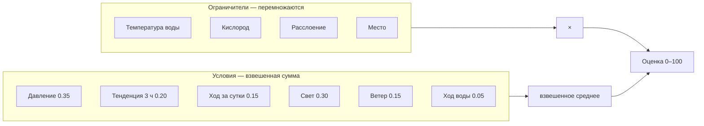

# Как считается клёв

Точное описание того, что делает
[CalculateFishActivityUseCase.kt](../../../src/main/java/com/example/fishforecast/domain/bite/CalculateFishActivityUseCase.kt)
сегодня: какие данные берёт, какие числа применяет и почему именно так. Чек-лист
[BiteFactors.md](../../BiteFactors.md) отвечает на вопрос «что мы обязаны знать»,
этот документ — на вопрос «как из этого получается 74».

Расчёт идёт **на устройстве, без сети**, по данным, которые уже лежат в Room.
Одинаковый вход всегда даёт одинаковый выход, и каждый фактор возвращает
пояснение: оценка без причины не проверяется, а рыбалка — это проверка.

## Что на входе

| Данные | Откуда | Обязательны |
|---|---|---|
| Почасовой прогноз: температура воздуха, давление, ветер со скоростью и направлением, облачность, радиация, осадки | Open-Meteo, кэш `weather_forecast` | Да |
| Норма давления района | Считается при сохранении карты по 70 суткам наблюдений или по высоте места | Нет: без неё давление не оценивается |
| Температура воды по слоям и кислород | Модель Эдингера по тому же прогнозу, глубины мели и ямы у района | Нет: без них расчёт идёт по воздуху |
| Восход и закат | `daily_sun` | Нет: без них фактор света отсутствует |
| Профиль вида: оптимум и предел температуры, пороги кислорода, гильдия, профиль света | Справочник видов | Да |
| Место: слой и структуры точки | `PlaceContext`, собирается из сохранённой точки и словаря | Нет: по умолчанию мель без особенностей |

## Какой прогноз запрашивается

Один вызов `api.open-meteo.com/v1/forecast` на район, по его центру:

```
hourly = temperature_2m, relative_humidity_2m, weather_code, surface_pressure,
         wind_speed_10m, wind_direction_10m, wind_gusts_10m, precipitation,
         precipitation_probability, cloud_cover, shortwave_radiation
daily  = sunrise, sunset
past_days = 7,  timezone = auto
```

Вперёд приходит неделя, назад — семь суток. Прошлое нужно не ради истории: на
нём разгоняется модель воды, и по нему же читаются суточный ход давления и ход
воды. Давление берётся **станционное** (`surface_pressure`), а не приведённое к
уровню моря: барометр телефона показывает именно его, а под Москвой разница
между ними 14 мм рт. ст.

## Норма давления района

Отдельный запрос, только давление, на всю доступную историю:
`past_days=92`, `forecast_days=1`. Модель хранит около семидесяти суток, дальний
край приходит пустым — это учтено.

```
норма = среднее по ряду наблюдений, если непустых часов ≥ 336 (14 суток)
      = давление стандартной атмосферы на высоте района, если ряда нет
```

Порог в четырнадцать суток стоит не случайно: короткий ряд усредняет не норму, а
погоду текущей недели. Запасной вариант по высоте даёт под Москвой (152 м)
746 мм против 746 по наблюдениям — разница в пределах округления.

Норма считается **один раз, в момент сохранения района**: тайлы как раз
качаются, значит сеть есть. Дальше она хранится у карты и не пересчитывается,
поэтому карта, сохранённая дома и увезённая на воду, приезжает туда с нормой.
Нормы нет вовсе — давление и тенденция не оцениваются, а не подменяются
диапазоном вида: норма это свойство места.

## Окна времени

| Что считается | Окно | Почему столько |
|---|---|---|
| Температура воды, кислород, свет, скорость ветра | текущий час | Это состояние, а не ход |
| Кислородный ход | 3 ч | Столько же, сколько у тенденции давления: они читаются вместе |
| Тенденция давления | окно вида, 1–24 ч | Карп отыгрывает перепад за два часа, судак за четырнадцать |
| Ход давления за сутки | 24 ч, минимум 6 | Жор идёт за 12–24 ч до фронта; при меньшей истории фактор молчит |
| Ход воды | 6 ч | Вода инертна: за три часа её движение не отличить от шума |
| Постоянство и разворот ветра | 6 ч | Нагон корма к берегу требует часов, а не минут |
| Расслоение | текущий час | Считается по разнице слоёв, а не по погоде: слои модель и так знает |
| Акклимация | 7 суток, минимум 24 ч | Столько длится основная часть перестройки обмена |
| Разгон модели воды | 7 суток назад | Ошибка начального значения затухает за 3–5 постоянных времени |
| Норма давления | 14–92 суток | Меньше двух недель — это погода, а не фон места |

## Общая формула

```
ограничители = Π vᵢ (limiting) × бонус места
условия      = Σ (wⱼ · vⱼ) / Σ wⱼ
оценка       = round(ограничители × условия × 100), 0..100
```

Разница между двумя группами принципиальна:

- **Ограничители перемножаются.** Непригодную для рыбы воду не искупает ни
  давление, ни ветер: если дышать нечем, всё остальное не имеет значения.
- **Условия складываются с весами** и лишь распределяют то, что осталось
  возможным.



## Факторы

| Фактор | Роль | Вес | Окно истории | Нет данных |
|---|---|---|---|---|
| Температура воды | Ограничитель | — | час | Считается по воздуху |
| Кислород | Ограничитель | — | 3 ч | Считается по воздуху |
| Расслоение | Ограничитель | — | текущий час, по разнице слоёв | Фактора нет в списке |
| Замечено | Ограничитель | — | срок наблюдения | Фактора нет в списке |
| Место | Ограничитель | — | — | Бонус 1.0 |
| Давление | Условие | 0.35 | час | Фактор равен 1.0 |
| Тенденция | Условие | 0.20 × k вида | окно вида, 1–24 ч | Фактор равен 1.0 |
| Акклимация | Правит оптимум | — | 7 суток, минимум 24 ч | Оптимум не сдвигается |
| Ход за сутки | Условие | 0.15 | 24 ч, минимум 6 | Фактор равен 1.0 |
| Свет | Условие | 0.30 | час | Фактора нет в списке |
| Ветер | Условие | 0.15 | 6 ч | — |
| Ход воды | Условие | 0.05 | 6 ч | Фактора нет в списке |

**Веса не нормированы по единице намеренно.** Сумма сырых весов 1.20, а расчёт
делит на сумму тех весов, которые удалось посчитать. Поэтому отсутствие данных о
восходе не роняет оценку на треть — оставшиеся факторы просто делят вес между
собой. Действующие доли при полном наборе: давление 0.29, тенденция 0.17, ход за
сутки 0.13, свет 0.25, ветер 0.13, ход воды 0.04.

Общая вспомогательная функция затухания:

```
falloff(расстояние, допуск) = clamp(1 − расстояние / допуск, 0, 1)
```

### Температура воды — ограничитель

У вида два диапазона: оптимум и предел выносливости. В оптимуме — единица, между
оптимумом и пределом активность линейно тает, за пределом её нет.

```
t в [optMin, optMax]          → 1.0
t < optMin                    → falloff(optMin − t, optMin − absMin)
t > optMax                    → falloff(t − optMax, absMax − optMax)
```

Ширина перехода у каждого вида своя: карась терпит остывание до градуса, налим в
двадцати двух уже задыхается. Поэтому падение считается от собственного предела
вида, а не от общей константы.

Температура берётся из модели воды нужного слоя плюс поправка структур
(донный ключ холодит место на 3 °C). Воды нет — берётся воздух, и фактор так и
называется: «Температура», а не «Температура воды».

### Кислород — ограничитель

Датчика нет, поэтому считается по воде. Растворимость — функция температуры
(Бенсон — Краузе): 14.6 мг/л при 0 °C, 11.3 при 10, 9.1 при 20, 8.2 при 25,
7.5 при 30. Насыщение умножается на аэрацию водоёма, поправляется ветровым
перемешиванием и уменьшается на ночной провал; структуры добавляют своё —
приток +0.5 мг/л, гнилой ил −1.5.

```
база = 1.0                                    при O₂ ≥ комфорт вида
     = 0                                      при O₂ ≤ критический
     = (O₂ − критический) / (комфорт − критический)   между ними

жара = falloff(вода − optMax, 12 °C)
значение = clamp(min(база, жара) + ход, 0, 1)
```

Порог берётся у вида: карасю хватает 0.5 мг/л, судаку нужно 4. Отдельно
учитывается **жара**: прогретая вода бьёт по рыбе раньше, чем растворимость
дойдёт до её порога, потому что с теплом растёт и собственная потребность.

Слагаемое `ход` — ±0.3 при движении воды на 0.3 °C за 3 часа, и оно работает
**только при воде выше optMax − 2 °C**. В пятиградусной воде кислорода почти
тринадцать миллиграммов на литр: полградуса прогрева там ничего не отнимают, и
штрафовать за них значило бы выдавать весну за ухудшение.

### Расслоение — ограничитель, появляется редко

Условие: слои разошлись на три градуса и больше **и** вода на мели выше оптимума
вида. Тогда столб распался, и рыба уходит из верхнего слоя.

```
расслоение = мель − яма ≥ 3 °C
мель ×0.80, если при этом мель горячее оптимума вида
```

Критерий тот же, что и у кислорода ямы: слои модель и так считает, и гадать по
шести часам штиля, как было раньше, больше не нужно.

**Яму фактор не штрафует.** Её беду — задохнувшийся гиполимнион — считает
кислород своего слоя; множитель сверху наказал бы её дважды за одно и то же.

Перемешанный столб расслоения не даёт, сколько бы ни держалась жара.

### Замечено — ограничитель, живёт по своему сроку

Отметка рыболова о том, что видно с берега: бой малька, птицы над водой,
радужная плёнка, ряска в углу. Эффект и срок берутся из словаря наблюдений.

```
затухание = 1 − прошло / срок           в пределах срока, иначе фактора нет
значение  = clamp(1 + Σ эффект · затухание, 0.4, 1.6)
```

Часы до отметки наблюдение не трогает: оно рассказывает о том, что уже
произошло. Гильдия соблюдается — бой малька касается хищника, гниение всех.
Множится с остальными ограничителями, а не складывается с условиями: увиденный
бой не «добавляет баллов», он говорит, что рыба здесь и сейчас кормится.

### Место — ограничитель

```
бонус = clamp(1 + Σ бонусов структур для гильдии, 0.4, 1.6)
```

Коряжник хищнику +0.25, мирной рыбе +0.1; заводь наоборот; гнилой ил обоим
−0.3. Даже самое гиблое место не обнуляет шанс полностью, и самое рыбное не
заменяет собой погоду.

### Давление — вес 0.35

Отсчёт идёт от **нормы конкретного водоёма**, а не от общей цифры: рыба
привыкает к фону своего места.

```
допуск   = maxDropMmHg вида, если давление ниже нормы
         = maxRiseMmHg вида, если выше
значение = falloff(|P − норма|, допуск)
```

Допуск берётся у вида и **несимметричен**: падение рыба переносит легче роста —
падающее давление она встречает кормлением, растущее вгоняет в апатию. У карася
это 14 мм вниз и 12 вверх, у судака 7 и 6.

Абсолютных границ у вида нет намеренно. Прежние 740–755 описывали равнину и
врали везде, где высота другая: на 500 м норма около 710 мм, и жёсткая нижняя
граница объявила бы обычный для места фон катастрофой.

Отклонение до 2 мм считается нормой. Нормы нет — фактор равен единице и честно
об этом пишет: подставлять сюда допуск вида не во что, норма это свойство
места.

### Тенденция — вес 0.20, помноженный на память вида

Окно не общее: его задаёт `pressure_recovery_hours` — за сколько часов вид
отыгрывает перепад давления. Открытопузырные (карп, плотва, лещ, щука)
стравливают газ через пищевод и приходят в себя за два-четыре часа;
закрытопузырные (окунь, судак, налим) газообменивают пузырь через кровь, и тот
же перепад держит их в апатии по двенадцать-восемнадцать часов.

Отсюда два следствия. Первое: окно градиента у карпа два часа, у судака
четырнадцать — общее трёхчасовое было для одного слишком длинным, для другого
слишком коротким. Второе: вес тенденции растёт вместе с памятью,
`k = clamp(0.7 + 0.05 · часы, 0.7, 1.6)` — рыба, которая выбирается из перепада
полсуток, зависит от него сильнее.

Величина и время разведены намеренно: **сколько** вид терпит задаёт допуск
(`max_drop_mmhg` / `max_rise_mmhg`), **как долго** помнит — окно отыгрыша.

| Условие | Значение |
|---|---|
| Изменение ≤ 1 мм и мы у нормы | 1.0 |
| Изменение ≤ 1 мм | 0.8 |
| Движение к норме | 0.9 |
| Изменение ≤ 3 мм | 0.5 |
| Больше | 0.2 |

Возврат к норме рыба встречает оживлением, уход в сторону — наоборот, поэтому
одинаковый по величине скачок оценивается по-разному.

### Ход за сутки — вес 0.15

Окно 24 часа, минимум 6; меньше истории — фактор равен единице.

| Изменение за сутки | Значение | Смысл |
|---|---|---|
| Падение ≥ 2.5 мм | 1.0 | Перед фронтом, рыба кормится впрок |
| Падение 1–2.5 мм | 0.9 | Понемногу падает |
| В пределах ±1 мм | 0.9 у нормы, иначе 0.8 | Сутки ровные |
| Рост ≥ 4 мм | 0.35 | Резкий рост после фронта |
| Рост, но давление у нормы | 0.65 | Фон привычный, меняется сторона |
| Прочий рост | 0.5 | Клёв вялый |

Прямой связи давления с кормлением наука не показала: в поле его не отделить от
остальной погоды. Это эвристика, и потому она весит меньше отклонения от нормы.

### Ход воды — вес 0.05

Окно 6 часов, шаг 0.3 °C. Знак зависит не от направления, а от того, с какой
стороны от оптимума стоит вода.

| Положение | Греется | Стынет | Стоит |
|---|---|---|---|
| Ниже оптимума | 1.0 | 0.55 | 0.8 |
| Выше оптимума | 0.5 | 1.0 | 0.75 |
| В оптимуме | 0.9 | 0.9 | 1.0 |

### Ветер — вес 0.15

Основа — скорость:

| Скорость | Значение |
|---|---|
| < 1.5 м/с | 1 − бонус ряби: 0.75 хищнику, 0.90 мирной |
| 1.5–5 м/с | 1.0 |
| 5–9 м/с | 0.7 |
| > 9 м/с | 0.3 |

Дальше множители по истории за 6 часов и по стороне:

| Условие | Множитель |
|---|---|
| Развернулся на ≥ 90° | ×0.8 |
| Держит сторону в пределах 45° | ×1.1 |
| Северный (315–45°) и вода ниже оптимума | ×0.85 |
| Северный и вода выше оптимума | ×1.1 |

Штиль «не разворачивается»: у слабого ветра направление случайно, поэтому
множители применяются только от 1.5 м/с. Итог зажимается в 0..1.

### Свет — вес 0.30

Фазы считаются от восхода и заката, а не от часов: летний рассвет в четыре и
зимний в девять — это одна фаза. Зори — окна ±45 минут вокруг события.

Значение берётся из профиля вида (`light_activity` в справочнике), а если его
нет — из профиля гильдии: у хищника пики на зорях, у мирной рыбы активность
размазана по светлому времени. Без данных о восходе фактор не участвует вовсе.

## Модели, на которые опирается расчёт

**Вода** — уравнение равновесной температуры Эдингера, шаг час:

```
Te = T_точки_росы + SWnet / K
K  = 4.5 + 0.05·Tw + (β + 0.47)·(9.2 + 0.46·w²)
τ  = ρc·h / K,  ρc = 4.186·10⁶
Tw ← Tw + (Te − Tw)·(1 − e^(−3600/τ))
```

Считается для двух глубин: мель и яма района. Отсюда инерция — при 1.5 м τ около
двух суток, при 5 м около недели. Замер термометром, если он есть, переставляет
модель на факт.

**Кислород** — насыщение по Бенсону — Краузе, поправленное аэрацией водоёма,
ветровым перемешиванием и ночным провалом (1.5 мг/л в малом пруду, 0.5 в
большом, 0 на реке).

Считается **отдельно для каждого слоя**. Пока столб перемешан, яма дышит вместе
с мелью и разница только в температуре. Но когда слои расходятся на три градуса
и больше, между ними встаёт термоклин: ветер до ямы не достаёт, дневного
кислорода от водорослей там нет, а донные отложения продолжают его тратить.

```
расслоение = мель − яма ≥ 3 °C
кислород ямы = насыщение(вода ямы) × аэрация − расход · часы расслоения / 24
```

Расход берётся у типа водоёма: полтора миллиграмма в сутки в малом пруду,
0.8 в большом озере, 0.2 на малой реке, ноль на большой. Литература даёт для
гиполимниона от 0.02 до 2.0 мг/л в сутки — продуктивный пруд стоит в верхней
части этого разброса.

Отсюда и рыба в термоклине: наверху жарко, внизу нечем дышать, и она стоит
между. Раньше расчёт брал для ямы кислород мели и завышал её шансы ровно там,
где рыбы нет.

## Пример

Карп, вода 19 °C, кислород 8.3 мг/л, давление 753 при норме 758, за сутки −1 мм,
ветер юго-западный 4.0 м/с шестой час, вечер. Истории меньше суток, поэтому
оптимум не сдвинут.

```
Ограничители:
  температура  19 < optMin 20 → falloff(1, 20−5=15) = 0.93
  кислород     8.3 ≥ комфорт 5.0 → 1.0
  место        мель без особенностей → 1.0
  итого        0.93

Условия (в скобках вес):
  давление     falloff(5, допуск карпа вниз 12) = 0.58   (0.35)
  тенденция    окно карпа 2 ч, стабильно, не у нормы = 0.80
               вес 0.20 × (0.7 + 0.05·2) = 0.16          (0.16)
  ход за сутки −1 мм → 0.90                              (0.15)
  свет         вечер, профиль карпа 0.90                 (0.30)
  ветер        1.0, держит сторону ×1.1 → 1.0            (0.15)
  ход воды     ниже оптимума, греется = 1.0              (0.05)
  сумма весов  1.16
  итого        (0.204+0.128+0.135+0.27+0.15+0.05) / 1.16 = 0.81

Оценка: 0.93 × 0.81 × 100 ≈ 75
```

Видно, зачем нормировка: у карпа тенденция весит 0.16 вместо 0.20, сумма весов
не единица, и без деления на неё оценка просела бы просто от того, что рыба
быстро отыгрывает давление.

## Температура: четыре разных масштаба

Вопрос «за сколько времени брать температуру» не имеет одного ответа, потому что
она действует на рыбу четырьмя способами сразу, и у каждого своё окно.

| Масштаб | Что происходит | В модели |
|---|---|---|
| **Час** | Обмен веществ. С теплом растут скорость пищеварения и потребность в еде: карп при 6 °C съедает сотые доли процента массы в сутки, при 24 °C выходит на максимум; лещ ниже 13 °C почти прекращает питаться | ✅ ограничитель по текущей воде |
| **6–24 часа** | Шок перемены. Резкое падение останавливает питание на 12–72 часа независимо от абсолютного значения; прогрев после холода, наоборот, запускает | ✅ ход воды, окно 6 ч |
| **3–14 суток** | Акклимация. Рыба перестраивает обмен под температуру, в которой стоит: акклимированная к 25 °C ест почти вдвое интенсивнее акклимированной к 15 °C. Сдвиг начинается уже за сутки и в основном укладывается в первую неделю | ✅ окно 7 суток, сдвиг оптимума |
| **Недели и месяц** | Накопленное тепло: сумма градусо-дней определяет нерест, посленерестовый провал, осенний жор | ❌ не учитывается |

**Практический вывод: недостающее окно — семь суток.** Оно сходится сразу с трёх
сторон. Большая часть акклимации проходит за первую неделю. Инерция самой воды
того же порядка: при полутора метрах постоянная времени около двух суток, при
пяти — около недели. И семь суток прошлого приложение уже качает — брать их
неоткуда не надо.

Месяц для клёва избыточен: он про сезон и нерест, а не про сегодняшний выезд.
Трёх суток мало — они не покрывают акклимацию и повторяют то, что уже говорит
шестичасовой ход воды.

**Как это устроено.** Средняя вода своего слоя за семь суток — температура
акклимации. Полоса комфорта сдвигается к ней:

```
сдвиг = clamp((акклимация − середина оптимума) × 0.3, −2 °C, +2 °C)
оптимум = [optMin + сдвиг, optMax + сдвиг]
```

Берётся не весь разрыв, а его доля, и сдвиг ограничен парой градусов: вид
остаётся собой, месяц ледяной воды не превращает щуку в налима. **Предел
выносливости не сдвигается** — привычка меняет аппетит, а не физиологию.

Меньше суток истории — сдвига нет: первые часы прогноза не должны выглядеть
иначе только потому, что смотреть назад ещё некуда. Когда сдвиг заметен, он
назван в пояснении: «рыба привыкла к холодной воде».

## Чего расчёт не учитывает

Короткий разбор с проверкой по коду и порядком работ —
[bite-score-gaps.md](bite-score-gaps.md).

| Не учитывается | Почему |
|---|---|
| Фаза луны | Влияние на пресноводную рыбу спорное, в модели трёх факторов его нет |
| Осадки и мутность | Хранятся и показываются, в оценку не входят; мутность влияет на выбор приманки, а не на аппетит |
| Наветренный берег как место | Нужен контур водоёма и разгон волны — работа по карте, не по погоде |
| Структуры точки в плане выезда | На вкладке «Клёв» они учитываются; у выезда выбранной точки нет, только слой |
| Собственный барометр | История датчика точнее сетевой, но пока показывается справочно |
| Календарь: нерест, жор перед зимой | Данных о сроках по конкретному водоёму нет |

## Где живут числа

Все коэффициенты — константы в
[CalculateFishActivityUseCase.kt](../../../src/main/java/com/example/fishforecast/domain/bite/CalculateFishActivityUseCase.kt);
пороги видов — в справочнике `initial_fish.json`; свойства водоёмов и структур —
в `knowledge.json`.

По [ADR-0003](../adr/0003-bite-model-out-of-code.md) веса и допуски переезжают в
документ `fishforecast.bite-model/1` (фаза 7), после чего их можно будет менять
из админки без релиза. Пороги видов уже живут документом, поэтому в таблицах
выше названы по имени поля, а не цифрой.
