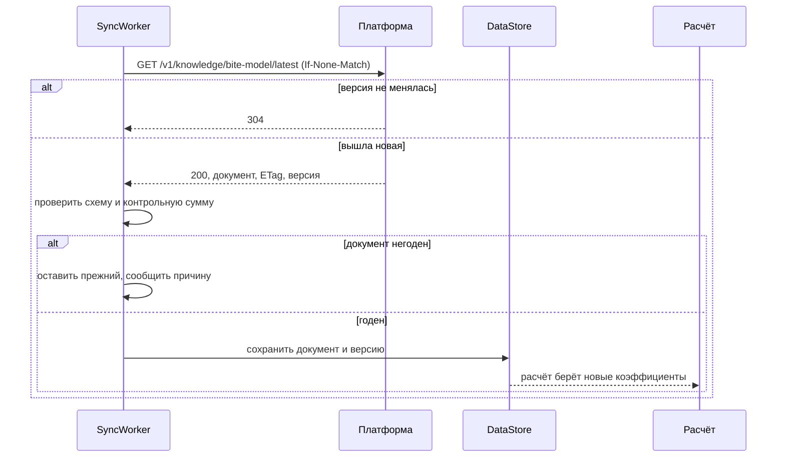

# Знания на клиенте: три документа и одна механика

Словари, справочник видов и модель клёва приезжают одинаково: документ с версией,
проверка схемы, кэш, откат на встроенное. Механика уже работает — её написали
для словарей и справочника ещё до сервера. Новое здесь только третий документ и
источник по умолчанию.

## Документы

| Документ | Схема | Что задаёт | Где хранится |
|---|---|---|---|
| Справочник видов | `fishforecast.fish-catalog/1` | Пороги температуры, кислорода и давления, гильдия, профиль света, наживки, правила прикормки | Room построчно: рыболов их правит, на них ссылаются точки |
| Словари знаний | `fishforecast.knowledge/1` | Типы водоёмов, структуры, наблюдения, способы ловли, схемы закорма, приманки | DataStore целиком: документ не правят по одному значению |
| Модель клёва | `fishforecast.bite-model/1` | Веса факторов, допуски, пороги ограничителей | DataStore целиком |

Первые два лежат в ассетах (`initial_fish.json`, `knowledge.json`) и служат
запасом. Третий появляется в фазе 7: сегодня его значения — константы в
[CalculateFishActivityUseCase.kt](../../../src/main/java/com/example/fishforecast/domain/bite/CalculateFishActivityUseCase.kt).

## Почему модель клёва становится документом

Веса факторов — это не алгоритм, а знание, которое уточняется по мере накопления
уловов. Пока они константы, любая правка стоит релиза приложения, а проверить
гипотезу на чужих данных нельзя вовсе.

Нынешние значения — исходная версия документа:

| Параметр | Значение в коде | Смысл |
|---|---|---|
| `WEIGHT_PRESSURE` | 0.35 | Отклонение от нормы водоёма |
| `WEIGHT_TREND` | 0.20 | Куда давление движется за 3 часа |
| `WEIGHT_LIGHT` | 0.30 | Фаза света и профиль вида |
| `WEIGHT_WIND` | 0.15 | Перемешивание и рябь |
| `PRESSURE_TOLERANCE` | 12 мм рт. ст. | Отклонение, при котором активность падает до нуля |
| `TREND_WINDOW_HOURS` | 3 | Окно тенденции |
| `HEAT_TOLERANCE`, `COOLING_BONUS`, `CALM_MS`, `RIPPLE_MAX_MS` | см. код | Пороги кислорода и ветра |

Внешняя таблица, с которой сверялась архитектура, предлагает другое
распределение — 0.40 давление, 0.30 тенденция, 0.15 ветер, 0.10 зори, 0.05
облачность. Расхождение не решается спором: оно решается прогоном обеих версий
по журналу уловов в песочнице админки. До тех пор действующая версия — та, что в
коде, а таблица остаётся кандидатом.

Ограничители (температура и кислород) остаются перемножающимися: непригодную воду
не компенсирует ничто. Документ задаёт их пороги, а не саму механику — механика
это код.

## Как приезжает обновление

Правила, которые уже действуют и не меняются:

1. **Поколение схемы должно совпасть.** Документ из будущего отвергается с
   понятной причиной, а не читается наполовину.
2. **Версия сравнивается до записи.** Одно и то же не перезаписывается при
   каждом открытии экрана.
3. **Негодный документ не оставляет без расчёта.** Приложение молча возвращается
   к встроенному.
4. **Смена адреса обнуляет версию.** У нового источника своя нумерация.
5. **Своё не затирается.** Описание вида, заведённые вручную виды и правки
   рыболова обновление не трогает.

## Источник по умолчанию

Сейчас адрес задаёт сам рыболов в диалоге «Источники знаний». С появлением
платформы адрес по умолчанию — её эндпойнт, а поле остаётся: свой справочник для
своего водоёма никто не отменяет. Экран показывает, какая версия действует и
откуда она пришла.

## Что видно рыболову

- Раздел справочника «Виды» упорядочен по сегодняшней воде — это и есть
  применение документа.
- Разделы «Водоёмы», «Структуры», «Закорм», «Наблюдения» показывают сами
  коэффициенты. Цифры видны намеренно: подсказка без причины выглядит гаданием.
- Модель клёва получает такой же раздел: какие веса действуют сейчас и какой они
  версии. Иначе объяснение «почему сегодня 62» опирается на невидимое.

## Воспроизводимость

Каждый улов записывает версию словарей и версию модели клёва, по которым
считался его `biteScore`. Без этого сверка прогноза с фактом через полгода
бессмысленна: неизвестно, какой моделью считали. Поэтому опубликованные версии
документов не удаляются никогда.
