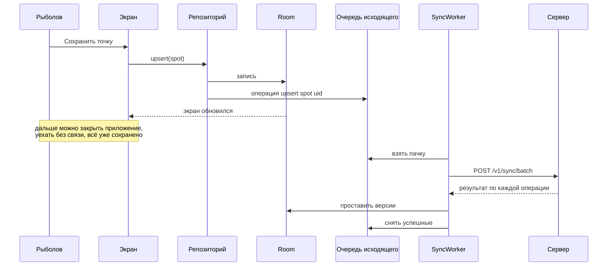
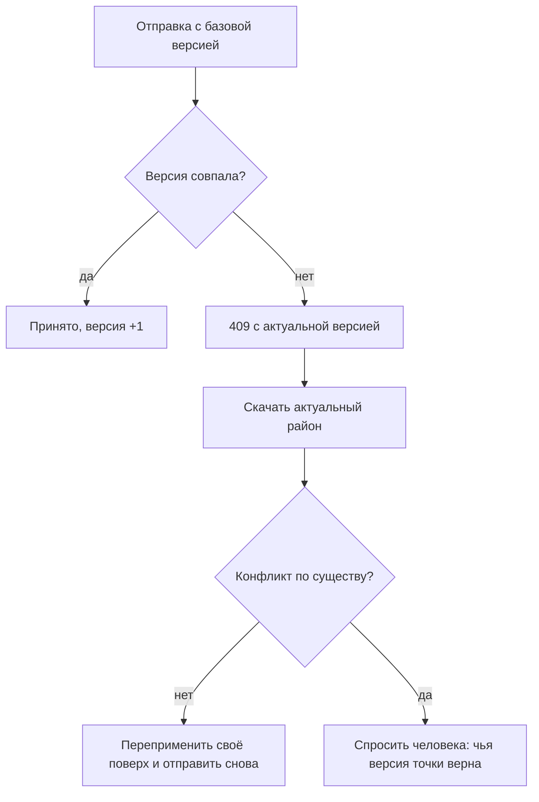

# Офлайн-первый контракт синхронизации

Как данные попадают на сервер и обратно, не ломая главного правила: на воде сети
нет, и приложение обязано работать так, будто сервера не существует.

## Принцип

**Сеть не участвует в записи.** Действие рыболова меняет Room и попадает на
экран немедленно. Отдельно от этого в очередь исходящего кладётся описание
изменения. Отправкой занимается воркер — когда появится связь и когда система
разрешит.

## Очередь исходящего

Таблица `sync_outbox`: тип сущности, глобальный идентификатор, операция
(`upsert` / `delete`), готовое тело, известная базовая версия, число попыток,
время создания.

Почему тело записывается целиком, а не собирается при отправке: между действием
и отправкой могут пройти сутки, и запись успеют изменить или удалить. Отправлять
надо то, что человек сделал, а не то, что осталось.

| Правило | Причина |
|---|---|
| Порядок сохраняется в пределах одной сущности | Создание не должно уехать после удаления |
| Разные сущности отправляются пачкой | Одна связь на воде — одна попытка на всё |
| У каждой операции свой ключ идемпотентности | Обрыв посреди отправки не создаёт вторых записей |
| Попытки с растущей паузой, потолок — сутки | Сервер лежит, а батарея не должна |
| После N неудач операция откладывается и показывается человеку | Тихо терять чужой труд нельзя |

## Что синхронизируется, а что нет

| Данные | Уходит | Почему |
|---|---|---|
| Район и точки | По явной публикации | Это секреты; автоматическая отправка недопустима |
| Улов | По выбору видимости | То же; по умолчанию `private` |
| Выезд | Обезличенно и по согласию | Ценен для калибровки, но это личное |
| Сообщения чата | Всегда, если чат открыт человеком | Смысл сообщения в доставке |
| Промер эхолота | По явной загрузке | Тяжёлый и личный |
| Прогноз погоды | Никогда | Приходит из Open-Meteo напрямую и на сервере не нужен |
| Настройки, активный район | Никогда | Свойство устройства, а не человека |

## Приём изменений

`GET /v1/sync/changes?since=` возвращает то, что поменялось с прошлого раза.
Клиент применяет по одному правилу: **совпал `uid` — та же запись.** Оно уже
работает при импорте пакетов и не меняется.

Особые случаи, где чужое не побеждает своё:

- **Пороги видов** не перезаписываются: справочник рыболов правит под себя.
- **Скачанная область тайлов и её размер** остаются: это про устройство, а не
  про место.
- **Свой замер воды** точнее чужого: он сделан здесь.

## Конфликты

У района есть счётчик версий. Клиент шлёт `If-Match` с той версией, поверх
которой он писал.

Автоматически сливается всё, что не пересекается: разные точки, разные поля.
Спорным считается изменение одного поля одной записи с обеих сторон — и это
единственный случай, когда рыболова спрашивают.

Для сообщений чата конфликтов не бывает: они только добавляются.

## Когда запускается синхронизация

| Повод | Условие |
|---|---|
| Появилась сеть | Ограничение WorkManager по подключению |
| Раз в 6 часов | Тем же расписанием, что уже работает у прогноза |
| Человек открыл ленту или чат | Явное ожидание свежего |
| Пришло `sync.invalidate` по WebSocket | Соединение открыто, значит связь есть |
| Пользователь нажал «обновить» | Всегда |

Ничего из этого не является обязательным: пропущенная синхронизация нагоняется
следующей, потому что запрос всегда «что нового с такого-то времени», а не «дай
следующий кусок».

## Поведение без сервера

Учётной записи нет, адрес платформы не задан, сервер лежит — приложение остаётся
полным по рыболовной части. Очередь исходящего копится (или не заполняется
вовсе, если публиковать нечего), социальные экраны показывают, что нужна сеть,
обмен районами идёт файлом. Это проверяется на каждой фазе прогоном в
авиарежиме — см. [06-traceability.md](../06-traceability.md).
