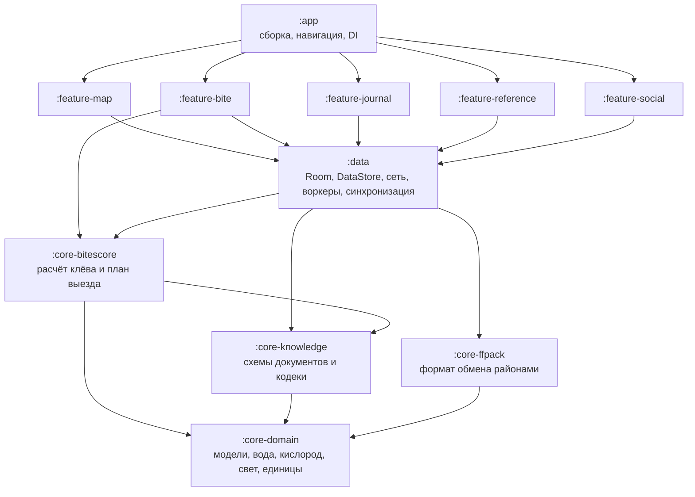
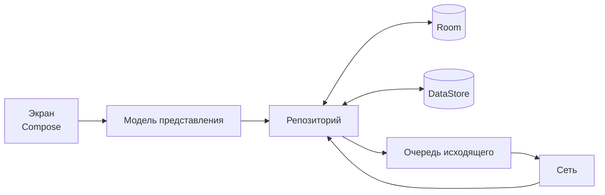

# Клиент: модули и слои (C4, уровень 3)

Как Android-приложение разложено внутри и почему именно так. Уровень выше —
[02-containers.md](../02-containers.md).

Сейчас проект — один Gradle-модуль `:app`, и границы слоёв держатся только на
дисциплине пакетов. Этого хватало, пока клиент был всей системой. С появлением
сервера и админки часть кода становится общим знанием, и его нужно отделить
физически: модуль, который нельзя импортировать, не может незаметно потянуть за
собой Room или Compose.

## Целевая структура модулей

| Модуль | Что внутри | Зависимости | Android |
|---|---|---|---|
| `:core-domain` | Модели видов и мест, модель воды по Эдингеру, кислород по Бенсону — Краузе, фазы света, единицы давления | Нет | Нет |
| `:core-knowledge` | Схемы `fish-catalog`, `knowledge`, `bite-model` и их кодеки с проверкой поколения | `:core-domain` | Нет |
| `:core-bitescore` | Расчёт активности, ограничители и веса, сборка плана выезда | `:core-domain`, `:core-knowledge` | Нет |
| `:core-ffpack` | Пакет района: сборка, разбор, правила слияния | `:core-domain` | Нет |
| `:data` | Room, DataStore, Retrofit, WorkManager, репозитории, очередь исходящего, отображение сущностей базы в доменные | все `:core-*` | Да |
| `:feature-*` | Экраны и их модели представления | `:data`, нужные `:core-*` | Да |
| `:app` | Сборка, навигация, DI-граф, тема | всё | Да |

## Правила зависимостей

1. **`:core-*` не знают об Android.** Это чистый Kotlin: их тесты запускаются без
   эмулятора, а логика однажды может уехать на другую платформу.
2. **`:core-*` не знают о Room.** Сегодня это нарушено:
   [FishCatalog.kt](../../../src/main/java/com/example/fishforecast/domain/fish/FishCatalog.kt)
   импортирует `FishEntity` ради `toEntity()`. При разделении отображение
   «документ ↔ строка базы» переезжает в `:data`, а `:core-knowledge` остаётся с
   одним лишь форматом.
3. **`:feature-*` не ходят друг к другу.** Общее у них — `:data` и `:core-*`.
4. **Расчёт не читает сеть.** Всё, что считается, берёт данные из базы; сеть
   только наполняет базу. Это уже так и должно остаться.

## Что переезжает из нынешних пакетов

| Сейчас | Станет |
|---|---|
| `domain/water`, `domain/light`, `domain/sensor`, `domain/weather` | `:core-domain` |
| `domain/fish`, `domain/knowledge` | `:core-knowledge` (модели и кодеки), отображение в базу — в `:data` |
| `domain/bite`, `domain/session` | `:core-bitescore` |
| `domain/share` | `:core-ffpack` |
| `data/**` | `:data` |
| `ui/map`, `ui/bite`, `ui/journal`, `ui/reference`, `ui/session` | одноимённые `:feature-*` |
| `MainActivity`, навигация, тема, DI-модули | `:app` |

Порядок переезда — в [07-phases.md](../07-phases.md), фаза 6. Переносится код без
изменения поведения: разделение и правка логики в одном изменении не
разбираются.

## Слои внутри модуля данных

Ключевое здесь — стрелка от репозитория к базе и только потом к сети. Запись
сначала ложится в Room, попадает на экран и в очередь исходящего; отправка
происходит потом и может не случиться вовсе. Подробности —
[offline-sync.md](offline-sync.md).

## Известный долг

То, что комплект фиксирует как вход в фазы, а не чинит по дороге:

| Долг | Где | Чем мешает | Фаза |
|---|---|---|---|
| Формат обмена знает про Room: `FishCatalog.toEntity()` импортирует `FishEntity` | `domain/fish/FishCatalog.kt` | Ядро нельзя отделить от базы | 6 |
| У улова нет `uid` и нет снимка воды, кислорода и фазы света | `data/local/entities/CatchEntity.kt` | Нечего синхронизировать и не на чем учиться; у выезда снимок полнее, чем у улова | 8 |
| `PlaceContext.structures` нигде не заполняется: оба вызова передают только слой | `data/repository/FishingSessionRepository.kt`, `ui/reference/ReferenceViewModel.kt` | Структуры точки показываются, но в оценку места не входят — половина смысла точки не работает | 8 |
| Веса модели клёва — константы | `domain/bite/CalculateFishActivityUseCase.kt` | Правка стоит релиза, сравнить две версии на одних данных нельзя | 7 |
| Зависимости от осени 2024 | `gradle/libs.versions.toml` | Копится разрыв, который дороже закрывать позже | 6 |

## Единый вход в контекст

`FishingContextRepository` остаётся единственным местом, которое знает, какой
район сейчасактивен и какие для него погода, вода и солнце. Экраны и воркеры
не собирают этот контекст сами — иначе он разъедется между вкладками.
