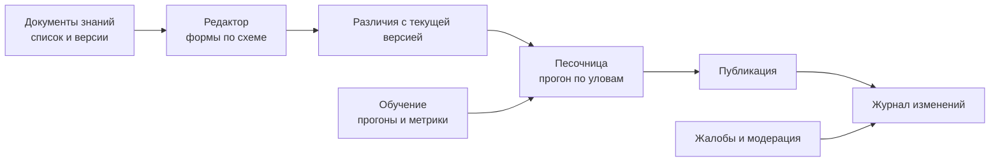
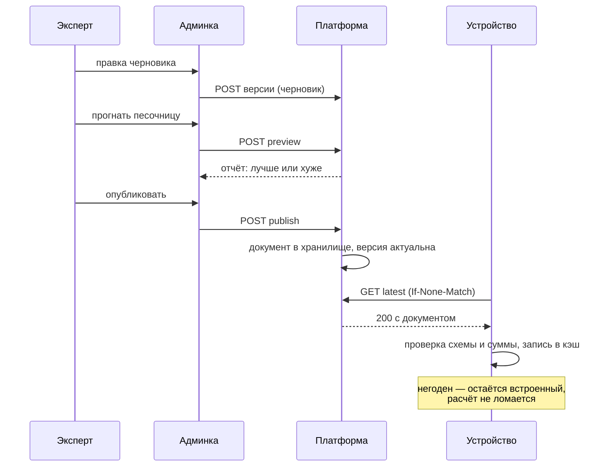

# Админка: рабочее место эксперта

Смысл панели одной фразой: **знание должно обновляться без сборки приложения.**
Пока словари и веса лежат в коде, каждая уточнённая цифра стоит релиза, а
проверить её можно только на себе.

## Кто и зачем сюда ходит

| Задача | Как часто | Что должно занимать |
|---|---|---|
| Поправить описание вида, добавить наживку | Часто | Минуты |
| Завести новый вид или структуру | Изредка | Полчаса с проверкой |
| Подвинуть вес фактора в модели клёва | Редко и осторожно | Час с прогоном по журналу |
| Выпустить обученные коэффициенты | По мере накопления данных | Полдня с разбором отчёта |
| Разобрать жалобу на район | По событию | Минуты |

## Экраны

**Документы знаний.** Три сущности: справочник видов, словари, модель клёва. У
каждой — история версий, кто и когда опубликовал, чем отличается от предыдущей.

**Редактор.** Формы строятся по схеме документа, а не по свободному тексту:
опечатка в имени поля не должна доезжать до телефонов. Экспертный режим с
правкой JSON остаётся — иногда быстрее так.

**Различия.** Что именно меняется: какие виды, какие коэффициенты, на сколько.
Публикация вслепую — главный способ сломать расчёт у всех сразу.

**Песочница.** Ключевой экран. Черновик прогоняется по сохранённым уловам со
снимками условий и показывает, стало ли предсказание ближе к факту:

- доля уловов, пришедшихся на часы с высокой оценкой;
- средняя оценка в час поимки против средней оценки в пустые часы;
- разбивка по видам и по типам водоёмов;
- сравнение с действующей версией бок о бок.

Здесь и решается спор о весах — цифрами, а не мнением.

**Публикация.** Отдельное действие с комментарием: что и почему поменяли.
Опубликованный документ ложится в объектное хранилище, версия отмечается
актуальной, клиенты подтягивают её при ближайшей синхронизации.

**Откат** — публикация предыдущей версии заново. История не переписывается: по
старым версиям воспроизводится, как считался улов полугодовой давности.

## Как выпуск доходит до телефона

## Технически

SPA поверх того же API, что и приложение: отдельного «админского» бэкенда нет,
есть роль и права. Это дешевле в поддержке и честнее — панель не может сделать
того, чего нельзя выразить контрактом.

| Решение | Причина |
|---|---|
| Отдельный фронтенд, а не формы на сервере | Песочница и различия — интерактивная работа, на серверных формах она мучительна |
| Тот же `/v1` API | Одна модель прав, одна валидация, одна документация |
| Черновик хранится на сервере | Работа эксперта не должна теряться вместе с вкладкой браузера |
| Публикация — отдельное право | Правит один, выпускает другой — если команда вырастет |

## Аудит

Каждое изменение записывается: кто, когда, что, с каким комментарием, какая
версия стала актуальной. Через полгода вопрос «почему у карпа поменялся порог
кислорода» должен иметь ответ.
