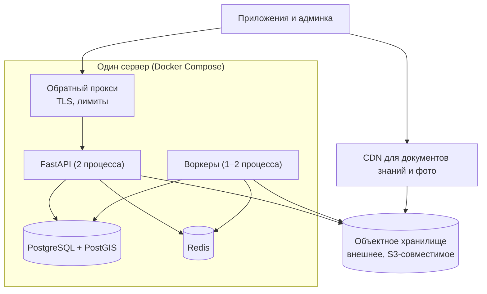
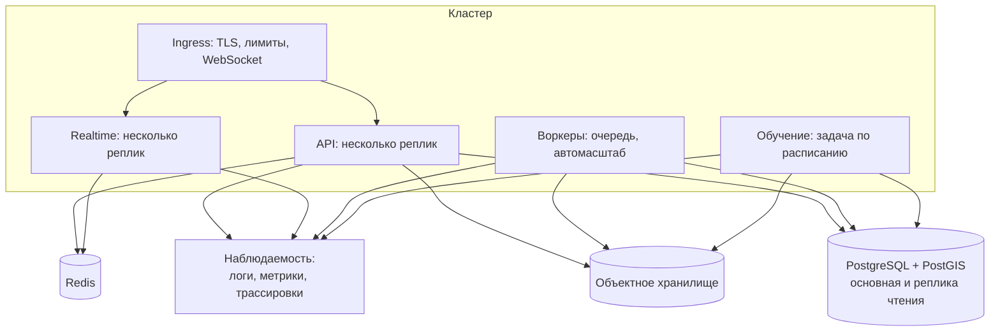

# Развёртывание

Где всё это работает. Документ описывает целевую картину и то, с чего начинается
путь к ней: поднимать сразу кластер ради сервиса, у которого ещё нет ни одного
пользователя, — способ потратить месяц на инфраструктуру вместо продукта.

## Окружения

| Окружение | Зачем | Данные | Кто ходит |
|---|---|---|---|
| Локальное | Разработка | Синтетика и обезличенные выгрузки | Разработчик |
| Предпромышленное | Проверка релиза и миграций | Копия схемы, обезличенные данные | Разработчик, эксперт |
| Промышленное | Пользователи | Настоящие | Все |

Клиент выбирает окружение адресом платформы — тем же полем, которым сегодня
задаётся адрес справочника. Отдельной сборки для этого не требуется.

## Первый шаг: одна машина

Этого достаточно на первые тысячи пользователей. Объектное хранилище берётся
внешнее сразу: переносить файлы потом дороже, чем начать правильно.

## Целевая картина

Что меняется по сравнению с первым шагом: реплики вместо одного процесса,
отдельный масштаб у реального времени (соединения живут долго и держат память),
реплика базы для чтения ленты, автомасштаб воркеров под обработку промеров.

## Данные и миграции

- Схема БД versioned-миграциями (Alembic), применяются на выкладке до старта
  новых процессов.
- Правило совместимости: новая версия кода должна работать со старой схемой хотя
  бы один релиз. Тогда откат возможен без восстановления из бэкапа.
- Разрушающие изменения (удаление колонки) — в два релиза: сначала перестаём
  писать, потом удаляем.
- Бэкапы: ежедневный полный, непрерывный журнал транзакций, хранение 30 дней.
  Восстановление проверяется учениями раз в квартал — бэкап, который не
  восстанавливали, бэкапом не является.

## Выкладка

| Шаг | Что происходит |
|---|---|
| Сборка | Образ API и воркеров, проверка контрактов, тесты |
| Миграции | Применяются отдельной задачей |
| Выкладка API | Постепенная замена реплик, старые продолжают отвечать |
| Проверка | Здоровье, ключевые метрики, дымовой сценарий |
| Откат | Предыдущий образ, схема совместима — данные не трогаем |

## Клиент

Приложение выкладывается в магазин обычным порядком и **не обязано выходить
вместе с сервером**: контракт версионируется, старые сборки продолжают работать.
Это не пожелание, а требование — обновление на телефонах растягивается на месяцы.

## Секреты и доступ

Ключи и пароли — в хранилище секретов окружения, в репозитории их нет.
Промышленная база доступна только из кластера. Прямой доступ разработчика к
данным пользователей — по заявке и с записью в журнал.
