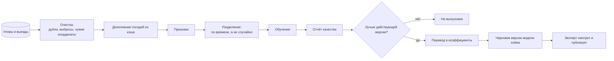

# Датасет и обучение

Контур замыкается здесь: рыболовы отдают уловы со снимком условий, сервер учится
на них и возвращает не модель, а **коэффициенты для той же эвристики**, которая
уже считает на телефоне.

Почему именно так — [adr/0004-no-on-device-ml.md](../adr/0004-no-on-device-ml.md).
Коротко: офлайн-расчёт должен быть проверяемым и объяснимым, а модель, которую
нельзя объяснить рыболову на берегу, ему не нужна.

## Откуда данные

| Источник | Что даёт | Осторожность |
|---|---|---|
| Уловы со снимком часа | Положительные примеры | Смещение: записывают чаще удачное |
| Выезды с результатом | Отрицательные примеры — пустые часы | Ради них выезд и записывает «поймал ноль» |
| Замеры воды термометром | Проверка модели воды | Их мало, но они самые ценные |
| Показания барометра устройства | Точная тенденция давления | Есть не на всех устройствах |

Пустой выезд — полноценные данные. Без него выборка состоит из одних успехов, и
модель уверенно говорит «клюёт» всегда.

## Строка выборки

Признаки собираются из снимка условий, который уже сохраняется у выезда и
достраивается у улова:

```
X = [ температура воды, ход воды за сутки, кислород,
      давление, отклонение от нормы места, тенденция за 3 часа,
      скорость ветра, нагонный ли ветер, облачность,
      фаза света, слой (мель или яма), структуры места,
      тип водоёма, вид рыбы, месяц ]

Y = поймал ли в этот час (0/1)  — основная задача
    вес и количество            — вспомогательные
```

Обязательные спутники строки: **версия словарей и версия модели клёва**, по
которым считался `biteScore` в тот момент. Без них через полгода нельзя понять,
что именно проверяется.

## Конвейер



**Разделение по времени, а не случайно.** Случайное разбиение подсунет модели
соседние часы того же выезда и покажет качество, которого нет.

**Перевод в коэффициенты.** Модель нужна не как чёрный ящик, а как источник
чисел для существующих факторов: веса давления, тенденции, света и ветра, ширина
допусков, пороги ограничителей. Годятся методы, из которых эти числа
вытаскиваются: логистическая регрессия напрямую, градиентный бустинг — через
анализ вклада признаков с последующей подгонкой весов эвристики под его
предсказания.

**Ворота перед выпуском.** Ни один прогон не публикуется автоматически. Решение
принимает человек в песочнице админки, глядя на сравнение с действующей версией.

## Метрики

| Метрика | Что показывает |
|---|---|
| AUC | Отличает ли модель клёвые часы от пустых |
| Brier | Насколько честны сами значения оценки |
| Средняя оценка в час поимки против пустого часа | Понятная человеку разница |
| Доля уловов в часы с оценкой выше 60 | То, ради чего приложение существует |
| Разбивка по видам и типам водоёмов | Не улучшилось ли на карпе за счёт налима |

## Локальность

Водоёмы разные, и общая модель не обязана быть лучшей везде. Порядок такой:

1. Общая модель — для всех, выпускается редко и осторожно.
2. Поправка по типу водоёма — когда данных хватит на группу.
3. Поправка по конкретному району — только если у него накопились десятки
   выездов; уезжает вместе с районом, а не в общий документ.

Локальная поправка на устройстве не обучается: она приходит с сервера тем же
документом. Клиент остаётся детерминированным.

## Приватность

В обучение попадает только то, что отдано явно. Из строки выборки убираются
идентификаторы автора и точные координаты — остаются тип водоёма, слой,
структуры и погода. Витрина датасета хранится отдельно от рабочей базы, и
удаление учётной записи удаляет и её строки: право на забвение сильнее удобства
обучения.
