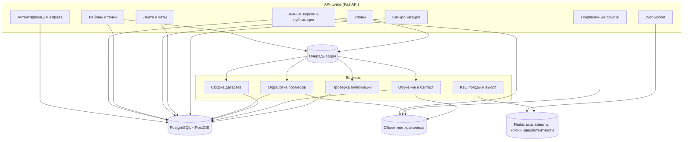

# Сервер: компоненты (C4, уровень 3)

Что внутри платформы и почему она устроена так скромно: сервер здесь не «мозг
системы», а склад версий, точка встречи рыболовов и лаборатория, где обучаются
модели. Решение о клёве по-прежнему принимает телефон.

## Сервисы шлюза

| Сервис | Отвечает за | Тяжёлую работу отдаёт |
|---|---|---|
| Аутентификация | Токены, роли (рыболов, эксперт, сопровождение), лимиты | — |
| Знания | Черновики, публикация, откат, раздача документов с ETag | Бэктест — воркеру обучения |
| Районы и точки | Приём и отдача пакетов, версии, пространственный поиск | Проверку публикаций — воркеру |
| Уловы | Приём со снимком условий, видимость, лента района | Сборку датасета — воркеру |
| Лента и чаты | Публикации, комнаты, история сообщений | Рассылку — WebSocket |
| Синхронизация | Пачки операций, идемпотентность, «что нового с такого-то времени» | — |
| Файлы | Подписанные ссылки на загрузку и скачивание | Сам файл идёт мимо шлюза |

## Воркеры

| Воркер | Запускается | Делает |
|---|---|---|
| Обработка промеров | По событию загрузки | Разбор, отсев, интерполяция в сетку, изобаты, оценка глубин слоёв |
| Сборка датасета | По расписанию | Собирает признаки и целевые переменные из уловов и выездов в витрину |
| Обучение и бэктест | По запросу эксперта и по расписанию | Учит модель, переводит результат в коэффициенты, считает отчёт качества |
| Кэш погоды | По расписанию | Тянет прогноз и высоты для районов, чтобы датасет не зависел от лимитов внешнего сервиса |
| Проверка публикаций | По событию | Санитарные проверки: район в воде, а не в поле; точки внутри границ; нет явного мусора |

## Что сервер сознательно не делает

**Не считает клёв для клиента.** Расчёт остаётся на устройстве: он должен
работать без сети и давать один и тот же ответ на одни и те же данные.
Предпросмотр в админке — исключение: там считается ровно тот же алгоритм, но по
историческим данным.

**Не хранит прогноз для клиента.** Погоду телефон берёт напрямую в Open-Meteo.
Серверный кэш нужен для датасета и песочницы.

**Не раздаёт тайлы.** Лицензии источников этого не разрешают.

**Не решает за рыболова, что публиковать.** Всё личное уезжает только по явному
действию.

## Права

| Роль | Может |
|---|---|
| Аноним | Читать документы знаний, искать и забирать публичные районы |
| Рыболов | Всё выше плюс публиковать своё, писать в ленту и чаты |
| Эксперт | Всё выше плюс править знания, запускать песочницу и публиковать версии |
| Сопровождение | Служебные метрики, повторный запуск задач, разбор жалоб |

Менять район может тот, кто его опубликовал; остальные предлагают изменения.
Иначе первый же спорщик перепишет чужие глубины.
