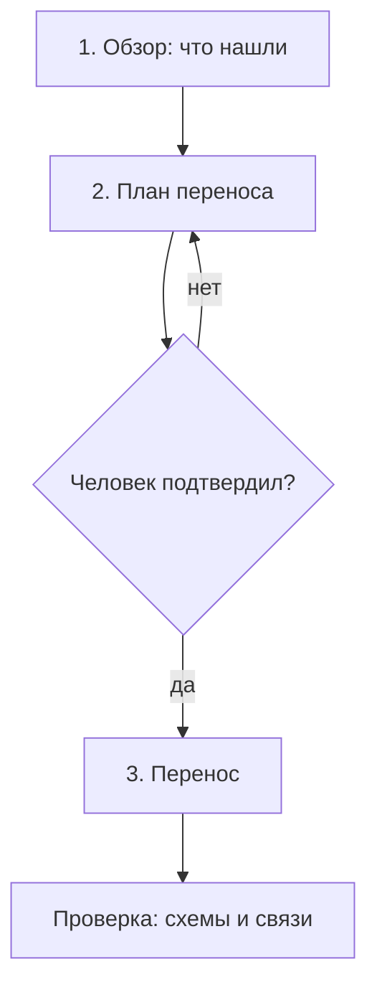

# Заведение формата в проекте

Два случая: проект пустой и проект, где документация уже есть. Второй —
основной, потому что документацию обычно начинают вести раньше, чем инструмент.

## Пустой проект

Приложение создаёт `docs/development/project.yaml`, папки из `paths` и первую
запись — требование или фазу. Дальше работа идёт как обычно.

## Проект с существующей документацией

Здесь приложение ничего не угадывает само. Пользователь говорит: «документация
есть, вот где она лежит», и она попадает в `sources.docs` манифеста. Дальше —
три шага, каждый с подтверждением.

**1. Обзор.** Приложение перечисляет найденные документы: путь, заголовок,
предполагаемый тип, есть ли front matter. Ничего не меняет.

**2. План.** Для каждого документа предлагается тип, идентификатор, новое
расположение и связи, которые видны по ссылкам внутри текста. План — это таблица,
которую человек правит перед применением. Здесь же видно, что перенести нельзя:
например, документ, который на самом деле три разных.

**3. Перенос.** Файлы копируются или перемещаются по плану, к ним добавляется
front matter. Текст не меняется. Все перенесённые документы получают статус
`draft` — подтверждение остаётся за человеком, потому что перенос не делает
документ верным.

## Роль языковой модели

Приведение к формату — это разметка, а не переписывание. Модель предлагает:

- тип записи и идентификатор;
- заголовок, если он не совпадает с первым `#`;
- связи, выведенные из ссылок и упоминаний;
- разбиение документа, который явно содержит несколько записей;
- требования, вытащенные из текста в виде отдельных `R-` записей.

Чего модель при импорте не делает: не правит формулировки, не «улучшает» стиль,
не выдумывает связи, которых нет в тексте. Любое её предложение попадает в план и
применяется только после подтверждения — то же правило DocDD, только применённое
к самой документации.

## Перенос архитектурного комплекта FishForecast

Комплект в `app/docs/architecture` — готовый кандидат на импорт. Отображение
получилось бы такое:

| Что | Тип | Куда |
|---|---|---|
| `00-manifest.md`, `02-containers.md`, `03-dataflow.md`, `04-data-dictionary.md`, `05-sequences.md`, `client/*`, `server/*` | `design` | `design/` |
| `adr/*` | `decision` | `decisions/` |
| `server/api/*.yaml` | `contract` | `contracts/` |
| Строки таблицы требований из `06-traceability.md` | `requirement` | `requirements/`, по одному файлу |
| Колонка «чем проверяется» оттуда же | `verification` | `tests/` |
| Работы из `07-phases.md` | `phase` + `task` | `phases/`, `tasks/` |

Это не сделано и делается отдельным решением: перенос разорвёт ссылки в
`README.md` и `Roadmap.md`, и цену этого стоит платить осознанно, а не заодно с
появлением формата.

## Что считать успешным импортом

- Все файлы разбираются по схеме.
- Ссылочная целостность без ошибок.
- У каждого требования есть хотя бы одна задача или проверка — иначе стало
  видно, что требование висело в воздухе и до импорта.
