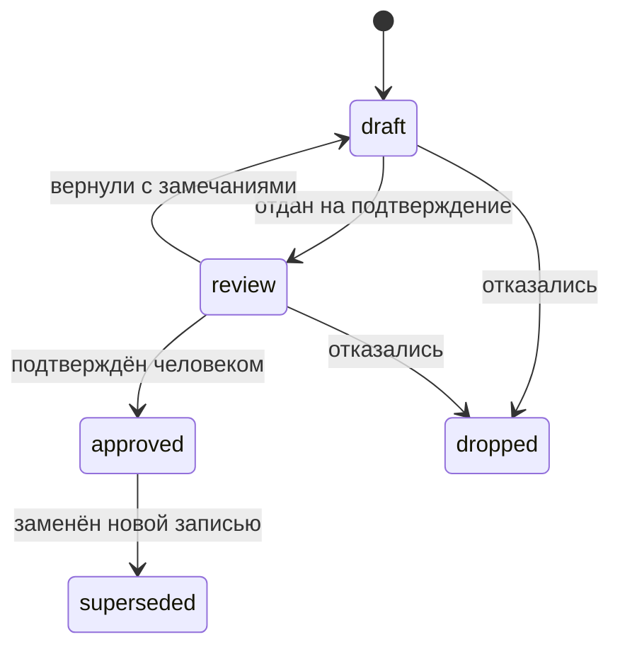
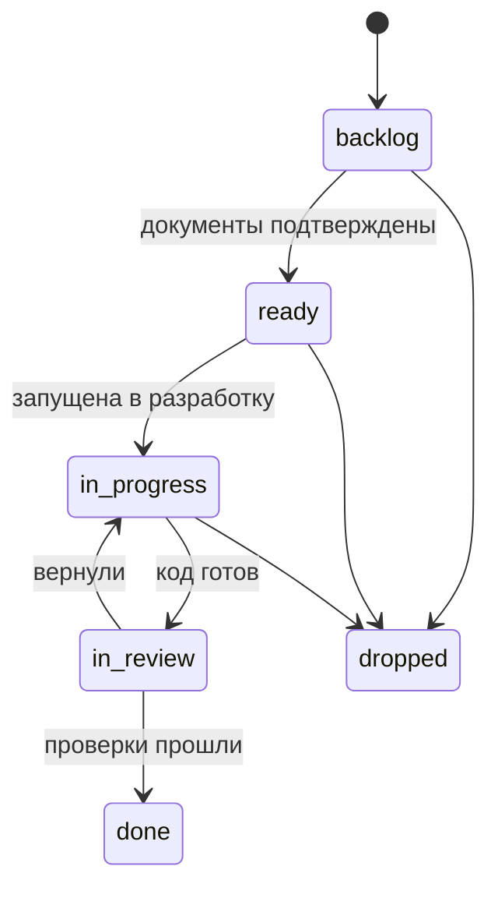
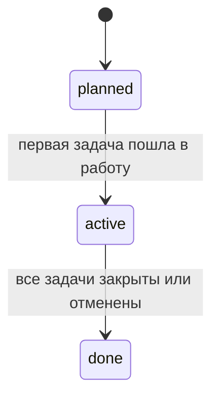

# Статусы и переходы

Статус — единственное поле, которое приложение меняет само. Всё остальное правит
человек, поэтому список состояний короткий, а переходы — с условиями, которые
можно проверить.

## Документы: требование, проект, решение, контракт



| Статус | Что означает |
|---|---|
| `draft` | Пишется. На него нельзя опираться |
| `review` | Ждёт подтверждения. Работа по нему не начинается |
| `approved` | Подтверждён. Только на такие документы ссылается работа |
| `superseded` | Заменён: обязательна ссылка `supersedes` из заменившей записи |
| `dropped` | Отказались. Файл остаётся ради истории |

У решений (`decision`) вместо `dropped` используется `rejected` — так принято в
ADR, и смысл тот же: рассмотрели и не взяли.

## Задачи



| Статус | Что означает | Условие перехода |
|---|---|---|
| `backlog` | Записана, но не готова к работе | — |
| `ready` | Можно брать | Все документы из `documents` и `refines` в статусе `approved`; есть хотя бы одна связь `implements` |
| `in_progress` | В разработке | Ручное действие человека. Это и есть «запустить в разработку» |
| `in_review` | Код написан, ждёт проверки | — |
| `done` | Закрыта | Все `verified_by` имеют результат `passed` в последнем отчёте, если включена политика `require_verification_before_done` |
| `dropped` | Отменена | Причина в теле файла |

## «Запустить в разработку»

Действие меняет `status: ready` на `in_progress`, проставляет `updated` и
записывает в тело файла строку журнала:

```markdown
## Журнал

- 2026-08-30 · в разработку · architect
```

Больше приложение не делает ничего: не создаёт веток, не запускает агентов, не
трогает код. Разработка ведётся там, где велась.

Переход запрещён, если задача не в `ready`. Причина отказа называется прямо:
какой документ не подтверждён или какого требования не хватает. Это и есть
контроль процесса — не напоминание, а невозможность начать.

## Фазы



Статус фазы приложение считает само по задачам из `covers`; вручную он не
ставится.

## Проверки

У записи `verification` статуса нет — есть последний результат из отчётов
прогонов: `passed`, `failed` или `unknown`, если прогонов не было. Это факт, а не
состояние: его нельзя «поставить».

## Правила, которые проверяются автоматически

| Правило | Уровень |
|---|---|
| Задача не может быть `ready`, если её документы не `approved` | Ошибка |
| Задача не может быть `in_progress`, минуя `ready` | Ошибка |
| Задача не может быть `done` без пройденной проверки, если политика включена | Ошибка |
| Требование `approved` без единой `verified_by` | Предупреждение |
| Документ `approved`, изменённый после закрытия задачи, которая его правила | Предупреждение |
| Задача `in_progress` дольше заданного срока | Предупреждение |
| Запись `superseded` без ссылки на заменившую | Ошибка |

Ошибки приложение не даёт обойти кнопкой. Предупреждения показывает списком —
решать человеку.
