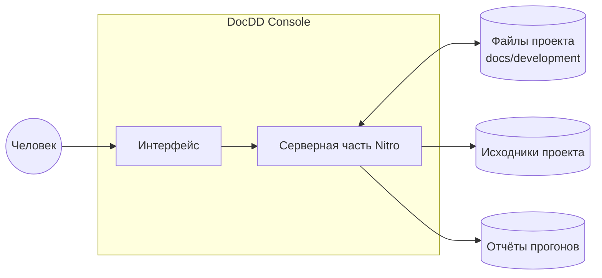

# Назначение и границы

## Задача

Правило «документ ведёт код» легко объявить и трудно соблюдать: связь между
требованием, документом, задачей и проверкой держится на внимательности того,
кто её помнит. Приложение делает эту связь машиночитаемой и показывает, где она
рвётся.

Три вопроса, на которые оно отвечает:

1. **В каком состоянии работа?** Сколько задач в каждом статусе, что зависло,
   какая фаза идёт.
2. **Что нарушает процесс?** Задача в работе с неподтверждённым документом,
   требование без единой проверки, закрытая задача с непройденным тестом.
3. **Что можно взять в работу прямо сейчас?** Задачи, у которых всё готово.

## Кто пользуется

Один человек на своей машине — архитектор или разработчик, ведущий проект. Прав
и ролей нет: роль в файле это подпись, а не доступ.

## Что приложение делает

- Читает `docs/development` выбранного проекта и строит граф записей.
- Проверяет схемы, ссылочную целостность и правила процесса.
- Показывает состояние работы: списки, карточки, граф, нарушения.
- Меняет статусы и пишет строку в журнал записи.
- Создаёт новые записи из шаблонов.
- Рисует диаграммы mermaid из документов.
- Читает отчёты прогонов тестов и связывает их с требованиями.

## Что приложение не делает — и это решения, а не «пока не успели»

| Не делает | Почему |
|---|---|
| Не заводит базу данных | Источник правды — файлы в репозитории проекта. Вторая копия начнёт расходиться в тот же день ([ADR-0001](adr/0001-files-are-the-truth.md)) |
| Не переписывает текст документов | Редактор у человека лучше, а правка текста — работа, а не действие процесса |
| Не делает коммитов и не создаёт веток | Историю ведёт git, и он делает это лучше |
| Не запускает агентов и сборки | Отвечает за состояние работы, а не за её выполнение |
| Не обращается к языковым моделям | Разметка и импорт — работа человека в его инструменте ([ADR-0003](adr/0003-no-llm-in-app.md)) |
| Не хранит обсуждения и комментарии | Для этого есть git и мессенджер |
| Не считает оценки и трудозатраты | Они не проверяются фактом и быстро врут |
| Не смотрит наружу | Локальный инструмент без аутентификации и удалённого доступа |

## Границы

Приложение читает исходники проекта только для одной цели: проверить, что ссылки
из документов на файлы кода ведут в существующие места. Ничего в них не меняет.

## Успех

Инструмент считается удавшимся, если им пользуются не ради отчётности, а потому,
что без него непонятно, что брать в работу. Признак обратного — папка
`docs/development`, которую правят руками в обход приложения, потому что через
него медленнее.
