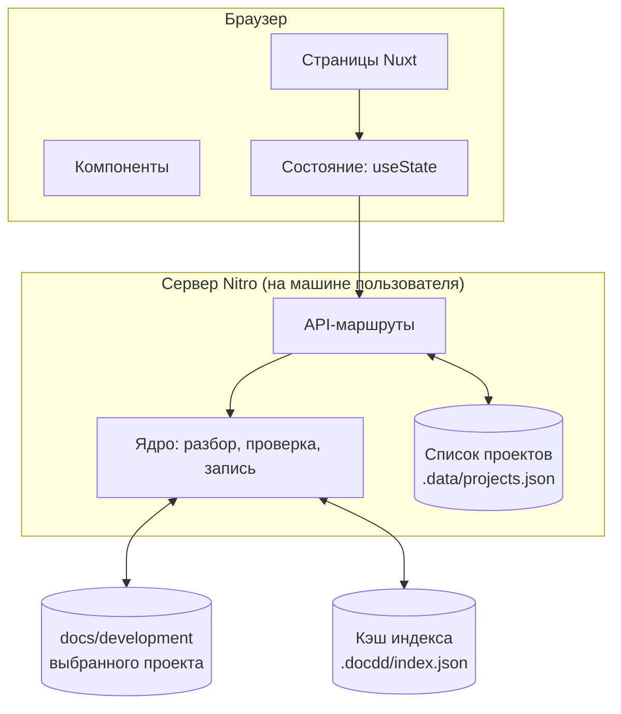

# Устройство приложения

## Две части



Браузер не знает о файловой системе вообще: он видит только JSON из API. Это не
формальность, а способ держать ядро тестируемым — разбор и проверка не зависят
ни от Nuxt, ни от браузера.

## Структура репозитория

```
app/                      интерфейс (Nuxt 4)
  pages/                  экраны
  components/             карточки, граф, списки
  composables/            обращения к API, состояние
server/
  api/                    маршруты Nitro
  lib/
    parse.ts              front matter и тело файла
    schema.ts             проверка по JSON Schema
    graph.ts              построение графа и обратных связей
    rules.ts              правила процесса
    write.ts              запись front matter и журнала
    paths.ts              безопасные пути внутри корня проекта
docs/                     эта документация
tests/                    тесты ядра
```

## Ядро: чистые функции

Всё, что в `server/lib`, работает со строками и объектами и не трогает
файловую систему само — её передают снаружи. Тогда тест выглядит так: подсунули
текст файла, получили запись; подсунули набор записей, получили список
нарушений.

Порядок обработки:

```mermaid
flowchart LR
    read["Чтение файлов"] --> parse["Разбор front matter"]
    parse --> validate["Проверка по схеме"]
    validate --> graph["Граф и обратные связи"]
    graph --> rules["Правила процесса"]
    rules --> index["Индекс"]
```

Ошибка на любом шаге не останавливает остальные: файл с негодным front matter
попадает в индекс как «нечитаемый» и виден в списке нарушений. Иначе одна
опечатка гасила бы весь проект — то же правило, что и у документов знаний в
проектах, которые этот инструмент обслуживает.

## Индекс и кэш

Индекс — результат прохода: записи, связи, нарушения, время сборки. Он
складывается в `.docdd/index.json` внутри проекта и пересобирается, когда
меняется время правки любого файла.

Кэш — производное. Его можно удалить, он не попадает в git, и приложение обязано
работать при его отсутствии.

## Список проектов

Пути к проектам хранятся серверной частью в `.data/projects.json` через хранилище
Nitro. Это единственные собственные данные приложения. Содержимое проектов не
копируется.

## Безопасность

Серверная часть работает только внутри объявленного корня проекта:

1. Путь приводится к абсолютному и нормализуется.
2. Проверяется, что он лежит внутри корня. Не лежит — отказ `403`.
3. Символические ссылки наружу не разворачиваются.

Приложение слушает только `localhost`. Аутентификации нет, потому что нет
удалённого доступа.

## Технологии

| Задача | Чем | Почему |
|---|---|---|
| Каркас | Nuxt 4, TypeScript | Просили браузерное приложение; Nitro даёт доступ к файлам без второго процесса |
| Разбор front matter | `gray-matter` + `js-yaml` | Сохраняет тело файла нетронутым |
| Проверка схем | Ajv | JSON Schema уже написаны контрактом |
| Диаграммы | `mermaid` | Диаграммы лежат в документах в этом формате |
| Разметка | `markdown-it` | Достаточно для показа документа |
| Граф | `d3-force` или готовый компонент | Решается в фазе 3, до неё граф — список связей |

Выбор обоснован в [adr/0004-stack.md](adr/0004-stack.md). Библиотеки компонентов
намеренно нет: экранов мало, а зависимость на годы.
